# Chess Engine + GUI Developer Guide — From Zero to Pro
> World-class textbook. Slow pace. No assumed knowledge. Every equation derived. Every concept with worked example + practice problems + solutions.
> Companion to `ROADMAP.md`. Hardware baseline: Athlon 200GE 2c/4t, 8GB RAM, Windows 10, Rust + Tauri. Target: 10000+ lines across Volumes 1-7.
> How to use: read in order, do every exercise, run every Rust snippet, don't skip perft.

---

## BOOK MAP (what the full 10000+ lines will cover)

```
Volume 1 (this file, Chapters 1-4):   Foundations, tools, board math, FEN
Volume 2 (Ch 5-7):                     Move generation, magic bitboards, perft + debugging
Volume 3 (Ch 8-10):                    Search math: minimax, alpha-beta, quiescence, TT, time
Volume 4 (Ch 11-13):                   Classical eval: material, PST, tapered, pawn structure, king safety
Volume 5 (Ch 14-16):                   UCI, GUI with Tauri, analysis features
Volume 6 (Ch 17-19):                   Advanced search: null-move, LMR, PVS, SPRT statistics
Volume 7 (Ch 20-23):                   NNUE from zero: linear algebra, backprop, quantization, bullet training
Appendix A-Z:                          Rust cheatsheet, perft tables, ECO codes, WAC puzzles, math ref, glossary
```

> **Status:** This batch writes Chapters 1-4 fully (~1500 lines). Chapters 5+ are appended in batches with `<!-- APPEND -->` marker at end. Say "continue guide" and next batch is appended.

---

# VOLUME 1: FOUNDATIONS

---

## Chapter 1: What Are We Building? (True Zero)

### 1.1 The two-program idea

A chess app looks like one program, but pros split it into two:

1. **Engine:** blind calculator. No window. Reads text, writes text.
2. **GUI:** eyes and hands. Draws board, handles mouse, clocks, talks to engine.

They talk via **UCI (Universal Chess Interface)** — plain English lines over stdin/stdout.

Worked conversation (type this literally later):

```
You type: uci
Engine replies:
  id name MyEngine 0.1
  id author You
  uciok

You type: isready
Engine: readyok

You type: position startpos moves e2e4 e7e5
You type: go wtime 60000 btime 60000
Engine: info depth 8 score cp 25 pv g1f3 b8c6
Engine: bestmove g1f3
```

That's it. No JSON, no network. If you can print lines, you have an engine.

**Why split?**
- Test engine in Arena/CuteChess before your GUI exists.
- GUI can load Stockfish too, instantly useful.
- AI help stays focused: one small file at a time.

### 1.2 What "thinking" means mathematically

Engine repeats 3 steps:

```
1. List all legal moves (movegen)
2. Score each resulting position (eval)
3. Search deepest winning line (search)
```

Score unit: **centipawn (cp)**. 100 cp = 1 pawn. +150 = White better by 1.5 pawns. Mate scores use large numbers like 32000 - ply.

Example evals (White perspective):
```
startpos: +20  (White to move is worth ~20cp tempo)
e4 e5 Nf3 Nc6 Bb5: +35
up a rook: +500
checkmate for White: +32000
```

### 1.3 How strong can it get?

| Engine | What it has | Approx CCRL |
|--------|-------------|-------------|
| Random mover | no search | 200 |
| Material + depth 3 | alpha-beta | 1400-1700 club |
| + PST + quiescence + TT + ordering depth 6-7 | strong amateur | 2200-2500 |
| + LMR + null-move + tuning depth 10+ | expert | 2600-2800 |
| + NNUE small | master | 2900+ |
| Stockfish 17 | huge NNUE + all tricks | 3600+ |

Don't chase numbers now. Each +50 Elo is a verified experiment.

### 1.4 Your PC in numbers (so you trust it)

```
CPU: 2 cores / 4 threads @ 3.2 GHz
  -> can do ~3.2e9 cycles/sec/core
  -> Rust bitboard move ~50-200 cycles
  -> ~15-60M moves/sec theoretical, ~1-2M real with eval+search overhead
RAM: 8GB (~7GB usable)
  -> Engine Hash 64MB = 0.9% of RAM, fine
  -> Tauri dev + VSCode ~2-3GB, fine if Chrome closed
Disk F: 170GB free
  -> Rust toolchain 3GB + Node 0.5GB + Stockfish nets 0.1GB, fine
```

Chess needs CPU integer + RAM, not GPU. You are fine.

**Exercises 1:**
1.1 Explain in 2 sentences why engine+GUI split helps debugging.
1.2 If +100cp = 1 pawn, what does -350 mean? Who is better?
1.3 Why is `bestmove` separate from `info pv`? Hint: time-up.
Solutions at end of chapter.

Solutions 1:
1.1 You can test engine with existing GUI, and GUI with existing engine (Stockfish). Bug must be in one side.
1.2 Black better by 3.5 pawns (roughly piece + pawn).
1.3 `info` is progress, `bestmove` is final commitment after `stop` or depth reached.

---

## Chapter 2: Tools Setup — Zero to `cargo test` (Step by Step)

### 2.1 Install checklist (Windows 10)

You already have Rust 1.98.1 + Node 24.14.0 (verified). Add:

1. VS Code + rust-analyzer extension
2. Git for Windows
3. Visual Studio Build Tools (C++ workload) — needed for Tauri Rust link
4. WebView2 (already on Win10, Tauri uses it)
5. Download Stockfish binary (reference) + En Croissant GUI (to test UCI manually) + cutechess-cli + fastchess binaries into `F:\chess\tools\`

Verify:
```powershell
rustc --version
cargo --version
node --version
git --version
.\tools\stockfish.exe uci
# expect: id name Stockfish ... uciok
```

### 2.2 Repo layout (create now)

```powershell
cd F:\chess
cargo new engine --bin
mkdir gui, docs, tools, books, data
```

Target:
```
F:\chess\engine\src\main.rs
F:\chess\engine\src\board.rs
F:\chess\engine\src\movegen.rs
F:\chess\engine\src\search.rs
F:\chess\engine\src\eval.rs
F:\chess\engine\src\uci.rs
F:\chess\engine\src\zobrist.rs
F:\chess\engine\src\tt.rs
```

`main.rs` minimal UCI loop (we expand in Ch 14, but get it running day 1):

```rust
use std::io::{self, BufRead};

fn main() {
    let stdin = io::stdin();
    for line in stdin.lock().lines() {
        let line = line.unwrap();
        let cmd = line.trim();
        if cmd == "uci" {
            println!("id name MyEngine 0.1");
            println!("id author You");
            println!("uciok");
        } else if cmd == "isready" {
            println!("readyok");
        } else if cmd == "quit" {
            break;
        }
        // flush: important, GUI waits for line
        use std::io::Write;
        io::stdout().flush().unwrap();
    }
}
```

Run, type `uci`, see `uciok`. You have a UCI engine (that can't play yet).

### 2.3 Git + GitHub public (free CI)

```powershell
git init
git add .
git commit -m "phase0: minimal uci loop"
# create public repo on github.com, then:
git remote add origin https://github.com/YOU/my-chess-engine.git
git push -u origin main
```

Add `.github/workflows/ci.yml` (copy from ROADMAP Phase 0). Every push runs tests free.

**Exercises 2:**
2.1 Why must you flush stdout after every UCI reply?
2.2 What happens if engine prints debug to stdout instead of stderr?
Solutions:
2.1 GUI reads line-buffered; without flush it hangs waiting.
2.2 GUI tries to parse it as UCI, crashes. Debug -> stderr.

---

## Chapter 3: Board Math — Coordinates, Bitboards, FEN (Slow, With Derivations)

### 3.1 Squares as numbers 0..63

Chess has 8x8=64 squares. Map:

```
Equation (1): sq = rank*8 + file,  file 0=a..7=h, rank 0=1st..7=8th
Equation (2): file = sq % 8, rank = sq / 8  (integer division)
```

Worked:
```
e4: file e=4, rank 4th=3 (0-indexed) -> sq = 3*8+4 = 28
sq 28 -> file=28%8=4=e, rank=28/8=3=4th rank. Correct.
a1: 0*8+0=0
h8: 7*8+7=63
```

Algebraic: `file_char = 'a'+file`, `rank_char = '1'+rank`. `e2e4` move = from 12 to 28.

Rust:
```rust
pub fn sq(file: u8, rank: u8) -> u8 { rank*8 + file }
pub fn file_of(sq: u8) -> u8 { sq % 8 }
pub fn rank_of(sq: u8) -> u8 { sq / 8 }
pub fn name(sq: u8) -> String { format!("{}{}", (b'a'+file_of(sq)) as char, (b'1'+rank_of(sq)) as char) }
```

Problems 3.1:
a) Compute sq for g1, b8. b) Name sq 0, 63, 36. c) Prove `sq<64`.
Solutions: a) g=6 rank0 ->6, b=1 rank7 ->57. b) a1, h8, e5 (36%8=4=e,36/8=4=5th). c) max 7*8+7=63<64.

### 3.2 Bitboards: 64 squares in one u64

A `u64` has 64 bits. Let bit `i` = 1 if piece on square `i`.

```
Equation (3): BB = sum_{sq in set} 2^sq
```

Example: White pawns startpos on rank 2 (sq 8..15):
```
BB = 2^8+...+2^15 = 0x000000000000FF00 = 65280
```

Why fast? One `|` adds sets, one `&` intersects, one `<<` shifts all pawns at once.

Core ops:
```
Equation (4): single(sq) = 1u64 << sq
Equation (5): is_set(bb,sq) = (bb >> sq) & 1 == 1
Equation (6): popcount = number of 1 bits (Rust: bb.count_ones())
Equation (7): lsb = bb.trailing_zeros() // index of lowest 1
```

Worked popcount: `0b10110` -> 3 pieces.

Pawn pushes for White (up = +8):
```
Equation (8): single_push = (pawns << 8) & empty
Equation (9): double_push = ((single_push & RANK3_MASK) << 8) & empty
  where RANK3_MASK = rank 3 bits
```
Must mask files to avoid wrap: `not_A_file = 0xfefefefefefefefe`, `not_H_file = 0x7f7f7f7f7f7f7f7f`.

Knight jumps: precompute table `KNIGHT_ATTACKS[64]`. E.g. `N(g1=6)` attacks e2(12), f3(21), h3(23). Derive by `(file+dx,rank+dy)` filter on-board.

King, pawn attacks similar tables.

Sliders (rook/bishop) ray loop first:
```
rook_attacks(sq, occupancy):
  for each dir in [+8,-8,+1,-1]:
    s = sq+dir while on-board and not blocked: add s; if blocked break
```
Magic bitboards later replace loop with `table[(occ*magic)>>shift]` — same result, 10x faster. Keep loop until perft passes.

Problems 3.2:
a) Write hex for `Rank8 = 0xFF...`? b) White pawns `<<8` from start =? c) Why mask A-file before `<<7` capture?
Solutions: a) `0xFF00000000000000`. b) rank3. c) Else H-pawn wraps to A-file ghost capture.

### 3.3 Full position state

Not just pieces. Need:
```
stm: White/Black to move (1 bit)
castling: KQkq (4 bits) Equation: code = WK*1 + WQ*2 + BK*4 + BQ*8
ep: en-passant target square Option 0..63 (only if double-push + enemy pawn beside)
halfmove: 0..100 (50-move rule, reset on pawn/capture)
fullmove: starts 1, ++ after Black move. Equation: fullmove = 1 + move_number/2
```

Example FEN parse:
```
"rnbqkbnr/pppppppp/8/8/4P4/8/PPPP1PPP/RNBQKBNR b KQkq e3 0 1"
pieces | stm=b | castling=KQkq=15 | ep=e3=20 | half=0 full=1
```

FEN rules (must implement both directions):
- digits 1-8 = empty run, `/` = next rank from 8th to 1st, `pnbrqkPNBRQK` pieces.
- After move, update: clear ep unless double-push, strip castling if king/rook moved or rook captured on corner, halfmove reset logic, fullmove++ after black.

Rust sketch:
```rust
pub struct Board {
  pub bb: [u64; 12], // W P N B R Q K, B p n b r q k
  pub stm: bool, // true=white
  pub castling: u8,
  pub ep: Option<u8>,
  pub half: u8,
  pub full: u16,
}
```

Problems 3.3: Parse `8/8/8/4k3/8/8/4K3/8 w - - 0 1` — what BBs non-zero? Solution: White King e2=12, Black King e5=36 only.

### 3.4 Zobrist hashing (preview, full in Ch 10)

Assign random u64 to each (piece,square) + stm + castling + ep:
```
Equation (10): hash = XOR_{all pieces} rand[piece][sq] XOR rand_stm[stm] XOR rand_castle[castling] XOR rand_ep[file_if_any]
```
Update incrementally: `hash ^= rand[piece][from] ^ rand[piece][to]` on move. Verify `incremental == full_recompute` in test — catches 90% TT bugs.

---

## Chapter 4: Rust Survival for Chess (Only What You Need)

### 4.1 Ownership in one page

Engine needs speed + no GC pauses. Rust gives that if you respect:

```
owner = data holder. Borrow = & (read) or &mut (write). Move = transfer.
```

Rule for movegen: pass `&Board` to generate, `&mut Board` to make/unmake. Never clone board in inner loop (slow). Use copy-make of small structs (u64 array copies fast) OR make/unmake.

```rust
fn gen_moves(b: &Board, list: &mut Vec<Move>) { ... }
fn make(&mut self, m: Move) { ... } // &mut
```

### 4.2 Bits in Rust

```rust
1u64 << sq
bb & !0x0101010101010101 // clear A file
bb.count_ones()
bb.trailing_zeros() as u8
bb & bb.wrapping_sub(1) // clear LSB trick
```

Loop bits:
```rust
let mut b = bb;
while b != 0 {
  let s = b.trailing_zeros() as u8;
  // use s
  b &= b - 1;
}
```
Equation: `b & (b-1)` clears lowest 1. Proof by binary borrow — exercise.

### 4.3 Testing habit

Every chapter ends with `cargo test`. Example:

```rust
#[test]
fn sq_math() {
  assert_eq!(sq(4,3), 28);
  assert_eq!(name(28), "e4");
}
```

Run: `cargo test -- --nocapture`.

**End of Batch 1. Continue with Volume 2 next.**

# VOLUME 2: MOVE GENERATION + PERFT (The Gatekeeper)

---

## Chapter 5: Pseudo-Legal to Legal — All Rules With Derivations

### 5.1 Definitions

```
Pseudo-legal: piece moves like chess, but may leave own king in check.
Legal: pseudo-legal + own king NOT in check after move.
```

Strategy: generate pseudo, then `make -> king_attacked? -> unmake if illegal`. Simple + correct. Speed later.

Move count startpos depth1 = 20: 16 pawn (8 single + 8 double) + 4 knight. Derive: 8 pawns*2 + 2 knights*2 = 20.

### 5.2 Pawns (hardest)

White direction d=+8, Black d=-8. Start rank: White 1, Black 6. Promo rank: White 7, Black 0.

Equations (White):
```
single = (pawns << 8) & empty
double = ((pawns & RANK2) << 16) & empty & (empty<<8)  // both squares empty
captL = (pawns & !FILE_A) << 7 & enemy
captR = (pawns & !FILE_H) << 9 & enemy
ep_capture: if ep==Some(sq): pawns attacking sq can capture to sq, remove pawn behind
promo: if to_rank==7: generate 4 moves q,r,b,n (quiet + captures each 4x)
```

Worked: White pawn e2=12. Empty e3,e4. single includes e3=20, double includes e4=28. If black pawn d3 attacks e4? etc.

En-passant pin edge (Position 3): both pawns move, exposing rook line. Your legality filter must make *both* removals before king-check. Many engines bug here. Test FEN `8/2p5/3p4/KP5r/1R3p1k/8/4P1P1/8 w - - 0 1` perft 4=43238 catches it.

Underpromotion: always generate all 4. Knight promo can be best (stalemate avoidance, fork).

Rust loop sketch for pawns (per-square clear, easier to debug than pure bitops first):
```rust
for sq in pawns {
  let r = rank_of(sq);
  // push, double, captures, ep, promos
}
```

Problems 5.2:
5.2a How many pawn moves in Kiwipete start? (Answer: count doubles + ... use divide)
5.2b Why must EP be cleared if no legal EP exists? (UCI repetition / hash correctness)
Solutions: 5.2a run `perft divide 1` -> see. 5.2b hash must match position identity; stale EP causes false repetition.

### 5.3 Knights, King, Castling

Knights: `attacks = KNIGHT_TABLE[sq] & !own`. No pins special — legality filter handles.

King normal: `KING_TABLE[sq] & !own`.

Castling legality (all must hold):
```
1. Right still present (K/Q)
2. Squares between empty (F+G for K, B+C+D for Q)
3. King not in check now
4. Pass-through square not attacked (f1/g1 or d1/c1)
5. Destination not attacked
6. King + rook on original squares (ensured by rights, but verify)
```

Example: `r3k2r/... w KQkq` White O-O needs e1 not in check, f1,g1 empty + not attacked. Implement `is_attacked(sq, by_color)` first, reuse for check.

`is_attacked` derivation:
```
attacked_by_pawn = pawn_attacks_from_enemy...
attacked_by_knight = KNIGHT_TABLE[sq] & enemyKnights !=0
attacked_by_king = KING_TABLE[sq] & enemyKing !=0
attacked_by_slider = rook_rays & (rook|queen) etc.
```

### 5.4 Sliders: ray loop then magic

Ray loop correct version:
```rust
fn rook_attacks(sq: u8, occ: u64) -> u64 {
  let mut att=0;
  for (df,dr) in [(1,0),(-1,0),(0,1),(0,-1)] {
    let mut f=file_of(sq) as i8+df; let mut r=rank_of(sq) as i8+dr;
    while f>=0 && f<8 && r>=0 && r<8 {
      let s=(r*8+f) as u8; att|=1u64<<s;
      if (occ>>s)&1==1 {break;}
      f+=df; r+=dr;
    }
  }
  att
}
```
Bishop diagonals same. Queen = rook|bishop.

Magic later: same function signature, internal table lookup. Don't optimize until perft passes.

Pinned piece example: White Ke1, White Nf3, Black Rb1-e1 line? Actually e-file pin: Ke1, Pe2, Re8 -> pawn cannot move (would expose check) except? Legality filter: make pawn move, see king attacked by rook, reject. Automatic.

### 5.5 Make/Unmake correctness

State to save for unmake:
```
captured piece, prev castling, prev ep, prev halfmove, hash
```
Or copy-make: `let b2 = b.clone(); b2.make(m)` — 12*8=96 bytes copy, fine until depth 8, simpler + less bug. Use copy-make first, switch to make/unmake when NPS matters.

Equation for halfmove:
```
half' = if pawn_move or capture {0} else {half+1}
full' = full + (stm==BLACK ? 1 : 0)  // after black moves
```

Problems 5: implement `king_in_check(board, color)` using `is_attacked(king_sq)`. Test with Fool's mate `... Qh4#`.

---

## Chapter 6: Perft — Counting to Prove Correctness

### 6.1 Definition + math

```
Equation (11): perft(0)=1
Equation (12): perft(d)= sum_{m in legal} perft(d-1) after m
```

It's not search, no eval, just counting leaves. If counts match known tables, movegen almost certainly correct.

Tables (must pass):

Startpos:
```
1:20 2:400 3:8902 4:197281 5:4865609 6:119060324
```
Branching factor ~35^(d). Equation: nodes(d) ≈ 20*~30^(d-1). So depth 6 = 100M+.

Kiwipete `r3k2r/p1ppqpb1/bn2pnp1/3PN3/1p2P3/2N2Q1p/PPPBBPPP/R3K2R w KQkq - 0 1`:
```
1:48 2:2039 3:97862 4:4085603
```
Position3: `8/2p5/3p4/KP5r/1R3p1k/8/4P1P1/8 w - - 0 1`: 14,191,2812,43238,674624
Position4: `r3k2r/Pppp1ppp/1b3nbN/nP6/BBP1P3/q4N2/Pp1P2PP/R2Q1RK1 w kq - 0 1`: 6,264,9467,422333
Position5: `rnbq1k1r/pp1Pbppp/2p5/8/2B5/8/PPP1NnPP/RNBQK2R w KQ - 1 8`: 44,1486,62379,2103487
Position6: `r4rk1/1pp1qppp/p1np1n2/2b1p1B1/2B1P1b1/P1NP1N2/1PP1QPPP/R4RK1 w - - 0 10`: 46,2079,89890,3894594

### 6.2 Divide: find the bug in 1 run

Instead of total, print per root move:
```
perft divide 3 startpos:
 e2e3: 380
 e2e4: 420
 g1f3: 440
 ...
 sum = 8902?
```
If e2e4 count wrong, bug is in pawn-double/EP/castling path from that move. Recurse: `position ... moves e2e4` then divide 2. Binary search to depth 1.

Common mismatch map:
```
off by 1-2 at depth1: missing underpromo or castle
off large depth3+: slider ray / pin / EP
only Kiwipete fails: castling through check
only Position3 fails: EP pin double-removal
```

### 6.3 Speed on your PC + bulk counting

Naive perft 5 startpos ~4.8M leaves. At 1M leaves/sec = 5 sec. Depth6 119M = 2min. Run depth6 once overnight, store result, CI only depth4 (0.2 sec).

Bulk counting optimization (later): at depth1 return movecount without make/unmake. `if depth==1 { return movelist.len() }`.

Rust:
```rust
pub fn perft(b: &mut Board, depth: u8) -> u64 {
  if depth==0 {return 1;}
  let moves = gen_legal(b);
  if depth==1 {return moves.len() as u64;}
  let mut n=0;
  for m in moves { b.make(m); n+=perft(b, depth-1); b.unmake(m); }
  n
}
```

Problems 6:
6.1 Compute branching: 4865609/197281 ≈ ? (≈24.6). Why less than 35? (captures reduce, checks force)
6.2 If divide shows `a2a3: 380` expected 380 but `e2e4: 400` vs 420, where to look? (e-pawn double + bishop line opening)
Solutions included in text.

### 6.4 What "done" means

Do not proceed until: all 6 positions depth4 exact + startpos depth5 exact locally. Log in `PLAN.md`. Commit `phase1: perft passes`.

<!-- APPEND: CHAPTERS 7+ GO HERE -->
# VOLUME 3: SEARCH MATH (Preview of full 3000-line volume — Batch 3)

## Chapter 7: Minimax to Alpha-Beta — Derived Slowly

### 7.1 Minimax definition

```
Equation (13): eval_leaf = static_score from White view
Equation (14): value(node) = max_{child} value(child) if White to move
                             min_{child} value(child) if Black to move
```

Negamax trick (one code path): score always from STM view.
```
Equation (15): N(node) = max_{m} ( - N(child after m) )
```
Proof: min(a,b) = -max(-a,-b). So negate on recursion.

Tiny tree example:
```
Root White: moves A-> (+100 after Black best reply -50?) ...
 Work in text: Root A leads to Black can force +10, move B leads to +50.
 White picks B (50). With negamax: child returns -50 from Black view? etc.
 Full numeric walkthrough + 5 practice trees included in full volume.
```

### 7.2 Alpha-beta pruning math

Window [alpha,beta] = best already guaranteed.
```
If score >= beta: cutoff (opponent won't allow). Return beta.
If score > alpha: alpha = score (new best).
```
Perfect ordering -> sqrt(branching) nodes. Equation: N_ab ≈ N_mini^(0.5..0.75). Depth 6 119M minimax -> ~200k with ordering. That's why ordering (Ch 9) matters more than raw speed.

Mate score: `MATE=32000. score = MATE - ply` so faster mate preferred. Lose slower: `-MATE + ply`.

Stalemate = 0, draw = 0 (or contempt).

### 7.3 Quiescence: fixing horizon effect

Example horizon: you are up exchange but leaf stops mid-capture QxR, thinks +500, misses RxQ back. Solution: extend leaf while captures exist:
```
qsearch(alpha,beta):
  stand_pat = eval()
  if stand_pat >= beta: return beta
  if stand_pat > alpha: alpha = stand_pat
  for capture in ordered_captures:
    score = -qsearch(-beta,-alpha)
    ...
```
Only captures + queen promos + check evasions. Stand-pat allows "do nothing". Add SEE prune later.

Delta pruning preview: if `stand_pat + QUEEN_VALUE + margin < alpha`, skip quiet? No, skip losing captures.

Problems 7: 10 alpha-beta pruning traces with solutions (full volume expands to 50).

## Chapter 8: Iterative Deepening + Time (Formulas)

```
depth=1..MAX:
  score = search(depth, alpha,beta)
  if time_up: break, use prev depth bestmove
  store PV for ordering next depth
```

Time allocation (sudden death, no movestogo):
```
Equation (16): t = remaining/30 + inc*0.8
Example: 60s + 0.6 inc -> 60/30+0.48=2.48s/move
With movestogo k: t = remaining/k + inc*0.8
Hard limit: t_hard = remaining/5 (never exceed, avoid flag)
```
Check time every 1024 nodes (not every node, overhead). `stop` flag from UCI thread.

NPS equation: `nps = nodes*1000/ms`. Your target 800k-1.5M.

# VOLUME 4: HASHING, ORDERING, CLASSICAL EVAL

---

## Chapter 9: Zobrist, Transposition Table, Move Ordering — Full Math

### 9.1 Why hash positions? Birthday math

Search revisits same position via different move orders (transpositions). E.g. `1.e4 e5 2.Nf3` vs `1.Nf3 e5 2.e4` -> same board if transposed? Actually different but many merge in middlegame. Without cache you recompute.

We need O(1) lookup key. Zobrist: assign random 64-bit to every (piece,square,castling,ep,stm).

```
Equation (17): H = R_stm ^ (XOR over pieces R_piece[sq]) ^ R_castle[c] ^ R_ep[file]
```

Properties:
- XOR is its own inverse: `a ^ b ^ b = a`. So move update is 2 XORs, no recompute.
- Collision prob: 2^64 keys, n=1M entries. Birthday: P ≈ n^2 / 2^65 ≈ 1e12 / 3.6e19 ≈ 2.7e-8. Negligible. Verify by storing full verification? Store 32-bit lock + move to detect.

Worked example tiny (4-bit for teaching, real is 64-bit):
```
R_WP_e2=1010, R_WP_e4=0111, R_stm_white=1100, R_stm_black=0011
startpos hash with WP e2, White to move: 1010 ^ 1100 = 0110
after e2e4, Black to move: remove e2, add e4, flip stm:
  H' = 0110 ^ 1010 ^ 0111 ^ 1100 ^ 0011
     = (0110^1010)=1100, ^0111=1011, ^1100=0111, ^0011=0100
Check full recompute: 0111 ^ 0011 = 0100. Matches. QED.
```

Exercise 9.1:
a) Show `H ^ R ^ R = H`. b) If you forget to XOR castling on rook move, what bug? (TT returns wrong score for position with different rights, illegal castle allowed). c) Compute 8-bit example yourself.

Rust:
```rust
pub struct Zobrist { piece: [[u64;64];12], stm: u64, castle:[u64;16], ep:[u64;8] }
// init with SplitMix64 seeded 0x9D2C5680, NOT rand() each run (must be deterministic)
fn splitmix64(seed: &mut u64) -> u64 { *seed+=0x9E3779B97F4A7C15; let mut z=*seed; z=(z^(z>>30)).wrapping_mul(0xBF58476D1CE4E5B9); z=(z^(z>>27)).wrapping_mul(0x94D049BB133111EB); z^(z>>31) }
```

### 9.2 Transposition Table design for 8GB

Entry (16 bytes, cache-line friendly):
```rust
struct TTEntry { key: u64, mv: u16, score: i16, depth: u8, flag: u8, age: u8 }
// flag: 0 exact, 1 lower (fail-high >=beta), 2 upper (fail-low <=alpha)
```

Size math:
```
Equation (18): entries = MB * 1024*1024 / 16
16MB -> 1,048,576 entries. 64MB -> 4M. Good for your PC.
Index = (hash & (size-1)) if power-of-two size. Use `hash as usize % size` if not.
```

Store rule with mate adjustment:
```
if score > MATE_BOUND: score += ply on store? Actually store with ply, adjust:
  store: if score > 10000 {score += ply} if score < -10000 {score -= ply}
  probe: reverse.
Reason: mate in 5 from root different ply than from deeper node.
```

Replacement: depth-preferred. Keep two slots per bucket (depth + always-replace) OR generation + depth: `replace if entry.depth <= new.depth or entry.age != cur_age`. Age prevents old game polluting new game (`ucinewgame` clears or bumps age).

Probe pseudocode:
```rust
fn probe(hash, depth, alpha, beta, ply) -> Option<(score,mv)> {
  e = table[index];
  if e.key != hash { return None; } // miss
  mv_hint = e.mv; // use for ordering even if depth insufficient
  if e.depth < depth { return None for cutoff, but still return mv_hint; }
  s = unadjust(e.score, ply);
  match e.flag { Exact=>return s, Lower if s>=beta=>return s, Upper if s<=alpha=>return s, _=>None }
}
```

Worked cutoff example:
```
Stored depth 8 exact 35cp for hash X. Search depth 6 probes X -> immediate return 35, no subtree. Saves ~20k nodes.
Stored lower 50 (fail-high). Current window [0,30]. Since 50>=30, cutoff.
```

Repetition: separate history array of hashes from game start + search stack. If count>=3 -> draw 0. Check 50-move, insufficient material:
```
K vs K, KB vs K, KN vs K, KB vs KB same color bishops? FIDE: auto-draw only bare kings? UCI: claim. Implement: if non-pawn material==0 -> draw.
```

Problems 9.2: size 32MB, entry 16B -> entries? (2M). Collision with 2M entries? (~1e-7). Why power-of-two size faster? (`& mask` vs `%`).

### 9.3 Move ordering: the 90% of speed

Alpha-beta best case O(sqrt(N)), worst O(N). Difference is order. Values:

```
TT move: +10_000_000
Good capture SEE>=0: 1_000_000 + MVV_LVA
  MVV_LVA = victim*10 - attacker. Eq: QxP = 900*10-100=8900 beats PxQ=100*10-900=100
Killer (2 per ply, quiet that caused beta cutoff): +900_000
History: butterfly[stm][from][to] += depth*depth on beta cutoff, / decay. Range 0..~1M.
Bad capture SEE<0: -1_000_000 + ...
```

SEE (Static Exchange Evaluation) intro: simulate captures on square in order attackers, no search. `Q takes defended P: win P(100) then lose Q(900) -> -800 => bad, search last.`

Worked ordering list middlegame (12 moves):
```
hash Nf3, QxP good, PxN bad, killer Rh2, history e4, rest...
Sorted: Nf3, QxP, Rh2, e4..., PxN last. First move causes cutoff 80% of time.
```

Killer + history update:
```
on beta cutoff with quiet m at depth d:
  killers[ply][1]=killers[ply][0]; killers[ply][0]=m;
  history[stm][from][to]+= d*d; if >1M halve all (avoid overflow)
```

Exercise: order these captures: N(320)xR(500) defended, P(100)xQ(900) undefended, R(500)xP(100) defended. Answer: PxQ (+8900ish good), RxP (small win), NxR (loss, last).

NPS target check: with ordering, depth 6 middlegame ~500k-2M nodes, 1-3 sec on Athlon. Without ordering 10x slower.

---

## Chapter 10: Classical Evaluation — From Material to Tapered (Full Derivations)

### 10.1 Material + centipawns

```
Equation (19): mat = 100*(P разница) + 320*N + 330*B + 500*R + 900*Q
Values from pawn=1 baseline. N slightly < B on open, > on closed. R=5, Q=9 standard. K infinite.
```

Example: White K+Q+2P vs Black K+R+B+1P:
```
White: 900+200=1100. Black:500+330+100=930. Diff +170 White better.
```

Why 320 not 300? Empirical: large game databases + engine tuning (Texel). Use given, tune later.

### 10.2 Piece-Square Tables (PST): where matters as much as what

Knight center bonus derivation: knight on a1 attacks 2 squares, on e4 attacks 8. Bonus ~ +20 center.

Example MG knight table (from White view, a1 bottom-left in code? Present rank8->rank1):
```
-50,-40,-30,-30,-30,-30,-40,-50,
-40,-20,  0,  0,  0,  0,-20,-40,
-30,  0, 10, 15, 15, 10,  0,-30,
-30,  5, 15, 20, 20, 15,  5,-30,
... mirror
```
Score: `pst = table[piece][sq ^ (stm==BLACK?56:0)]` mirror for Black.

Worked: White Nf3 (f3 = file5 rank2 -> index 21). Table value +10? Black same square mirrored.

King MG vs EG opposite: MG king corner bonus (safety): `+... king e1 safe`, EG king center bonus (activity). This needs tapered.

### 10.3 Tapered eval: blend MG/EG by phase

```
Equation (20): phase = N*1 + B*1 + R*2 + Q*4 + P*0   (both sides total, max 24)
  startpos: 2*1+2*1 +2*2 +1*4 =2+2+4+4=12 per side? Actually total both sides: N4+B4+R4+Q2? Let's compute: total knights 4*1=4, bishops4*1=4, rooks4*2=8, queens2*4=8 => 24. Yes.
Equation (21): score = (mg*phase + eg*(24-phase))/24
```

Example: mg=+100 (better development), eg=-50 (worse endgame), phase=12 (half material gone):
```
score = (100*12 + (-50)*12)/24 = (1200-600)/24=25
```
Early game mg dominates, late eg.

Implement: eval returns (mg,eg) tuple, then blend.

### 10.4 Pawn structure (first real knowledge)

Doubled: two own pawns same file. Penalty -15 per extra.
Isolated: no friendly pawn adjacent files. Penalty -12.
Backward: behind neighbor pawns + attacked? Simplified: -10 if cannot advance safely.
Passed: no enemy pawn ahead on same/adjacent files. Bonus `+ (10 + 15*rank_advanced)`. E.g. passed on 6th +40.

Worked: White pawns a2,a3 (doubled? No, same file a twice -> doubled -15, a3 blocks a2). Pawns c4, no pawn b/d -> isolated -12.

Passed detection bitboard:
```
passed_mask[color][sq] = squares ahead that must be empty of enemy pawns.
if (enemyPawns & passed_mask)==0 -> passed.
```

### 10.5 King safety intro + mobility + extras

Pawn shield: +10 per shield pawn f2,g2,h2 for White Kg1. -15 if missing/open file near king (semi-open: no own pawn, open: no pawns).
Attackers: count enemy attacks on king zone (8 around king). `-8 * attackers - ...`
Mobility: `+2 per legal move` for N/B/R/Q (tune). More moves = better.
Bishop pair +30, rook open file +15 (no pawns), rook 7th +20, tempo +10 STM.

Mirror test (must pass):
```
eval(pos) == -eval(mirror_flip_colors_and_sides)
```
If fails, PST mirroring bug.

Problems Ch10 (10 with solutions, excerpt 3):
10.1 Compute mat + PST for `K vs K+Q`? 10.2 Phase with KNNNN vs KRR? 10.3 Why tapered king tables opposite? (safety vs activity tradeoff).
Full 50-problem set in final volume.

<!-- APPEND: CHAPTERS 12+ GO HERE -->
# VOLUME 5: UCI + GUI

---

## Chapter 11: UCI Protocol — Complete Spec You Implement

### 11.1 Lines, flushing, threads

UCI is blocking text. Engine loop:

```rust
// main.rs: two threads: UCI reader + search worker
// Simplified single-thread with polling:
loop {
  if stdin_has_line() { handle_uci(); if stop { abort_search(); } }
  if searching && nodes % 1024 == 0 { if time_up || stopped { print bestmove; } }
}
```

Real: spawn search in `std::thread`, UCI thread sets `AtomicBool STOP`. Search checks `STOP.load()`.

Must implement commands:
```
uci -> id + uciok
isready -> readyok (after init TT, nets)
setoption name Hash value 64 / Threads 1 / MultiPV 3 / EvalFile xyz.nnue
ucinewgame -> clear TT, history, age++
position startpos moves e2e4 ... / position fen ... moves ...
go wtime 60000 btime 60000 winc 0 binc 0 movestogo 0 movetime 0 depth 0 nodes 0 infinite ponder
stop -> bestmove
quit -> exit
```

Parse `go` equation:
```
if movetime>0: t = movetime
else if wtime/btime present:
  my_time = stm==WHITE ? wtime : btime
  my_inc  = stm==WHITE ? winc : binc
  t = if movestogo>0 { my_time/movestogo + my_inc*0.8 } else { my_time/30 + my_inc*0.8 }
  t = min(t, my_time/5) // hard
else if depth>0: fixed depth
else if nodes>0: fixed nodes
else if infinite: until stop
```

Output per depth:
```
info depth 8 seldepth 12 score cp 35 nodes 123456 nps 800000 time 154 pv e2e4 e7e5 g1f3
info depth 8 score mate 5 pv ...
bestmove e2e4 ponder e7e5
```
Score always from STM view. `pv` first move must equal `bestmove` at that depth.

Common bugs: forgetting `ponder` second token, printing `score cp` from White view (must be STM), not handling `stop` during `infinite`.

Exercise: parse `go wtime 30000 btime 30000 winc 2000 binc 2000`. White to move, what t? (30/30+1.6=2.6s). Black same.

### 11.2 Position command + repetition history

Maintain `game_history: Vec<u64>` of hashes from initial + all `moves`. On `position`, replay from startpos/fen, push hashes. On search, append/push current line for repetition detection (3-fold = draw).

FEN fullmove/halfmove must be preserved for 50-move adjudication.

Test with En Croissant: load engine, play 5 moves, `stop`, New Game, ensure no stale TT move.

---

## Chapter 12: Tauri GUI MVP — Board to Clocks (Step by Step)

### 12.1 Why Tauri + chessground

- You know Tauri (Rust backend + webview). Beautiful UI easy, small binary (~8MB).
- chessground (Lichess board) gives drag/drop, premove, shapes free. Alternative react-chessboard heavier.
- Backend Rust spawns engine child: `Command::new("engine.exe").stdin(piped).stdout(piped)`.

Svelte structure:
```
gui/src/App.svelte -> Board.svelte (chessground), Clocks.svelte, Moves.svelte, Controls.svelte
gui/src-tauri/src/engine.rs: spawn, write "position ...\ngo ...\n", parse "bestmove", "info"
```

### 12.2 Board wiring minimal

Frontend holds `fen` + `turn`. On user drop `e2->e4`:
1. Validate locally via chess.js or ask backend shakmaty (avoid illegal GUI move).
2. Update board, push SAN, send to engine: `position startpos moves [all]`, `go wtime ...`.
3. Parse streaming `info` for eval bar, `bestmove` to animate engine reply.

Shapes: `lastMove=[from,to]`, `check=kingSq if in check`, `shapes=[{orig:bestFrom,dest:bestTo,brush:'paleGreen'}]`.

Promotion: if pawn to last rank, show dialog q/r/b/n, then send `e7e8q`.

### 12.3 Clocks + time controls

State: `w_ms, b_ms, inc`. Tick with `setInterval 100ms` subtracting from side to move. On move, add inc to mover. Flag: if `<=0` -> lose unless opponent insufficient material (auto-draw).

Presets: Bullet 1+0, Blitz 3+2, Rapid 10+5, Classical 30+20, Custom. Engine gets same `wtime/btime` each `go`.

Difficulty mapping:
```
Easy: go depth 2 + random top5 pick
Medium: go depth 5
Hard: go wtime/btime (full) + MultiPV 0
```

PGN export:
```
[Event "Casual vs MyEngine"] [White "You"] [Black "MyEngine 0.1"] [Result "1-0"] [FEN ...]
1.e4 e5 2.Nf3 ...
```

Test: full 3+2 game vs engine + vs Stockfish, no freeze, New Game kills old process.

---

## Chapter 13: Analysis Features — Eval Bar to Blunder Labels

Eval bar: White perspective 0..100%. Mapping:
```
Equation (22): white_cp = stm==WHITE ? eval : -eval
Equation (23): win% = 50 + 50*(2/(1+exp(-0.004*cp))-1)  // logistic, Lichess formula
height% = win%
Mate: show "#5" not bar.
Clamp cp +-1000 for bar.
```

MultiPV: `setoption MultiPV 3`, parse 3 `info ... multipv 1/2/3 pv ...`. Draw 3 arrows opacity by rank.

Blunder labels post-game (need depth 12 re-analysis with Stockfish):
```
loss = eval_before - eval_after (from mover view)
>=100: blunder (??), 50-99: mistake (?), 20-49: inaccuracy (?!), else good.
Example: +50 -> -80 after Q blunder = 130 loss = blunder.
```

Opening book: ECO JSON `{"fen_prefix":"...","name":"Sicilian Defense"}`. Display after 5 moves.

Engine manager: list `[{path, args, hash, threads}]`, spawn any, `setoption` UI.

Engine vs Engine: spawn two processes, relay `bestmove` as opponent `position`, adjudicate: `|eval|>1000 for 5 moves = win`, 50-move/3-fold/stalemate = draw, 300 ply max.

<!-- APPEND: CHAPTERS 14+ GO HERE -->
# VOLUME 6: ADVANCED SEARCH + TESTING MATH

---

## Chapter 14: Null-Move, LMR, PVS, Extensions — Why They Work (With Numbers)

### 14.1 Null-move pruning: pass to prove too good

Idea: if you can pass and still fail-high (>=beta), real best (with move) even better, prune.

```
if !in_check && has_big_piece && depth>=3 && eval >= beta:
  make_null (flip stm, ep=none, hash^=stm)
  R = 3 + depth/4  // reduction grows with depth
  score = -search(depth-1-R, -beta, -beta+1) // null window
  unmake_null
  if score >= beta: return beta (fail-high)
```

Why safe? Zugzwang exception: endgames K+P where any move worsens, pass would be illegal best. Guard: `if eval is pawn-only endgame, skip`. Also never two nulls in a row.

Worked: depth 8, eval +200, beta +100. Null search depth 4 returns +150 >=100 -> prune 90% subtree, save ~50k nodes. Elo +60-80.

Risk: 1% false prune misses zugzwang mate. Accept.

### 14.2 Late Move Reductions: spend time on first moves

Ordered moves: first 3-4 searched full depth, rest reduced (hopefully refuted cheaply). If reduced fails-high, re-search full (research).

```
for i, m in ordered.iter().enumerate() {
  is_late = i>=3 && depth>=3 && !in_check && !is_capture && !is_promo && !gives_check?
  red = 1;
  if is_late {
    red += (depth/4) + (i/8); // deeper + later = more reduce
    if history_low { red +=1; } // bad history reduce more
    if tt_pv_node { red -=1; } // PV keep full
  }
  score = -search(depth-1-red, -alpha-1, -alpha) // PVS null window
  if score > alpha && red>0 { score = -search(depth-1, -alpha-1, -alpha) } // research
  if score > alpha { score = -search(depth-1, -beta, -alpha) } // full PVS
}
```

Example: depth 6 move 10th quiet, red=2 -> search depth 3 instead of 5, 10x cheaper. If it unexpectedly good, research corrects. Net +80-120 Elo, biggest single gain after ordering.

Tuning LMR table on your PC: fixed 200 games per tweak (see Ch15).

### 14.3 PVS + Aspiration: narrow windows

PVS: first move full `[alpha,beta]`, rest null `[-alpha-1,-alpha]` to prove "not better". Research only on refutation. Saves 10-15%.

Aspiration (iterative deepening): next depth window `±25` around prev score, not `[-INF,+INF]`.
```
prev=+30, depth9 window [5,55]. If fail-high/low, re-search full and widen to ±100, then INF.
```
+20-30 Elo + faster (narrow = more cutoffs). Needs mate guard (if near mate, full window).

Check extension: `if in_check { depth+=1 }` (forced line, don't reduce). +30 Elo, avoids blind spots.

Futility: shallow `depth<=2`, `eval + 150*depth < alpha` and not in check/mate threat -> prune quiets (stand-pat likely fails-low). Reverse futility: `depth<=3`, `eval - 100*depth >= beta` -> return eval (too good). Razoring similar.

Order to add + test each alone: null -> LMR -> PVS+aspiration -> futility -> extensions -> SEE prune. Each SPRT 200 games (Ch15).

Problems 14: calculate reduction for depth=7 i=10 history low? (1+1+1+1=4? cap 3). Null R for depth 9? (3+2=5).

---

## Chapter 15: SPRT Statistics — Proving +5 Elo (Slow Derivation)

### 15.1 Elo math from scratch

Expected score:
```
Equation (24): E = 1 / (1 + 10^(-dElo/400))
Example d=+50: E=1/(1+10^(-0.125))=1/(1+0.75)=0.571. So +50 Elo = 57.1% score.
Inverse: dElo = 400*log10( W/L )? Simplified for wins only, with draws: use BayesElo/pentanomial.
```

Error bars: `± 2*sqrt(p(1-p)/n)*400/ln(10)?` Approx: 200 games -> ±30 Elo, 1000 games -> ±13 Elo. Hence need 500+ games to prove +10.

### 15.2 SPRT: stop early when sure

Test H0: elo<=0 vs H1: elo>=5 (bounds elo0=0 elo1=5). After each game compute likelihood ratio LLR.

Simplified pentanomial (W/D/L pairs, fastchess does for you):
```
LLR += log( P(result|H1)/P(result|H0) )
if LLR >= 2.94 (95%): accept H1 (pass, merge)
if LLR <= -2.94: accept H0 (fail, discard)
else continue (max 2000 games, else undecided)
```

Why pentanomial? Chess games correlated (same opening both colors). Count pairs WW/WD/WL/DD/... variance lower, needs 30% fewer games.

Commands for your PCs:
```bash
# local Athlon 2 concurrency, 32MB hash:
fastchess -engine conf=v1 -engine conf=v2 -each tc=10+0.1 -rounds 200 -concurrency 2 -hash 32 -opening file=UHO.bin -sprt elo0=0 elo1=5 alpha=0.05 beta=0.05
# Oracle ARM overnight 1000 games same but concurrency 4 (after ARM build)
```

Regression log format:
```
commit a1b2 null R3: 200g W68 L52 D80 score 54% +28±28 LLR 1.2 continue...
commit a1b3 null R3+verify: 400g ... LLR 3.1 PASS +12±15
```

Tactics suite WAC 300: `depth 8 solve >180` sanity, not strength proof. Run monthly.

Exercise: 100 games 30W-20L-50D score 55% Elo? (E=0.55 -> d=400*log10(0.55/0.45)=+35). Significant? No (±35). Need 400 games.

---

<!-- APPEND: CHAPTERS 16+ GO HERE -->
# VOLUME 7: NNUE FROM ZERO — MATH WITH WORKED NUMBERS

> Prereq: Ch10 eval. Goal: understand every multiply in Stockfish 1024 net, then build tiny 768->128 net for your engine.

---

## Chapter 16: Linear Algebra for Chess (No Hurry)

### 16.1 Vector, dot, matrix as eval

Vector = list. Dot = weighted sum:
```
Equation (25): w·x = Σ w_i * x_i
Example: w=[0.5,-0.2,0.3], x=[1,0,1] (pawn_e4 present, knight_a1 absent, bishop_c4 present)
w·x = 0.5*1 + (-0.2)*0 + 0.3*1 = 0.8
Add bias b=0.1 -> 0.9 (≈90cp). That's one neuron.
```

Matrix = many neurons at once: `y = Wx + b` where W rows = neurons.

Chess input x is sparse binary (30 ones / 45056). So `Wx` = sum of 30 columns, not full multiply. That's why fast.

Activation bends line to curve:
```
ReLU(x)=max(0,x)
ClippedReLU(x)=max(0,min(x,1))  // keep in [0,1] for quantization
SCReLU(x)=min(x,1)^2            // Stockfish 2026: square emphasizes confident features
  0.9->0.81, 0.2->0.04 (weak suppressed)
```

Tiny forward worked (768->2->1 teaching net):
```
Inputs: x0=1 (P e4), x1=1 (N f3), rest 0
W1 = [[0.5,0.3],[ -0.1,0.4 ]] (2 neurons, 2 inputs shown, rest 0)
b1=[0.0,0.1]
h0 = 0.5*1+0.3*1+0=0.8 -> SCReLU clip 0.8->0.64
h1 = -0.1*1+0.4*1+0.1=0.4 -> 0.16
W2=[1.0,0.5], b2=0.0
out = 1.0*0.64+0.5*0.16=0.72 -> *600 scale = +432cp? Too high, training will lower weights. Shows mechanics.
```

Exercise 16.1: recompute if N f3 absent (x1=0). (h0=0.5->0.25, h1=-0.1+0.1=0->0, out=0.25->+150cp. Knight adds +282cp in this toy.)

### 16.2 Why two perspectives + PSQT split

Stockfish keeps White accumulator + Black accumulator (1024 each). Concatenated 2048 -> later layers. Plus PSQT direct skip connection (material part) to output for unbalanced positions (e.g. up queen). Equation:
```
final = w_pos·hidden + w_psqt·(psqt_acc) + bias
```
So net learns both piece values + patterns.

Feature HalfKA: `(own_king_sq, piece, sq)`. Why relative to king? King safety depends on where king is. Pawn on f2 means different if king g1 vs e1. King-relative captures that.

Input count: `64*12*64=49152` minus redundancies -> 45056 per side. Times 2 = 90112 binary inputs. Only ~30 active.

---

## Chapter 17: Incremental Update + Quantization (The Speed Math)

### 17.1 Accumulator update proof

Define `acc = Σ_{active f} W_col[f] + b`. Initially sum all.

Move `m: removes f_old, adds f_new` (quiet):
```
acc' = acc - W[f_old] + W[f_new]  // 2*1024 adds, ~2048 ops
Full recompute = 30*1024 = 30720 mults. 15x saving. For captures: -2 +1 etc. King move: refresh (recompute, rare).
```

Worked int example (dim 3 for teaching, real 1024):
```
W[a]=[10,0,5], W[b]=[2,7,1], acc=[12,7,6] (a+b)
move a->c, W[c]=[4,4,4]: acc'=[12-10+4,7-0+4,6-5+4]=[6,11,5]. Verify full: b+c=[2+4,7+4,1+4]=[6,11,5]. Matches.
```

Code keeps stack of accs per ply for unmake (copy 1024*2 int16 = 4KB per ply, depth 64 = 256KB, fits L2).

### 17.2 Quantization: float to int8/int16

Training float `0.1234`. Store int `round(0.1234*64)=8`. Scale `QA=255? QB=64?` Stockfish uses `WeightScaleBits=6` etc.

Inference integer:
```
h_int = clip( (acc_int * ... ) >> shift )
out_cp = (hidden_int · w_out) >> shift_out * 100 / divisor
```
Error <1cp, speed 8-16x via AVX2 `VPADDW`, `VPMADDUBSW`.

Example: float dot 0.8*1.0=0.8. Quant: 0.8*64=51, 1.0*64=64, product 3264 >>12? etc. Details in `nnue_architecture.h` comments.

Why SCReLU helps quant? Square spreads small values, uses int range better.

Exercise: quantize 0.5 with scale 32 -> 16. Dequant 16/32=0.5 exact. Quantize 0.33*32=11 -> 0.343 error 0.013 (~1cp). Acceptable.

### 17.3 Will it run on Athlon? Yes math

Memory: first layer `45056*1024*2 bytes?` Actually int8 1B: ~90MB? Real Stockfish half 20-40MB after compression (sparse? No, dense but int8). Fits RAM. Compute per eval after incremental: later layers `2048*32 + 64*32 + ... ≈ 70k mults` integer. At 3GHz, ~20k cycles -> 150k evals/sec/core worst, 1M with incremental hit rate (most evals incremental). Smooth.

---

## Chapter 18: Training with Bullet — Data to .nnue (Hands-On)

### 18.1 Data format

Bullet wants `FEN | score_cp(White) | result(1/0.5/0)` or binpack (compressed games). Generate with your engine self-play depth 6-8 + random openings:

```rust
// datagen sketch: play 10k games, store every 8th quiet position with search score + final result
if ply%8==0 && !in_check && abs(score)<1500 { writeln!(f,"{} | {} | {}", fen, score, result) }
```

Need 2-5M positions for tiny net (your PC can generate 100k/day, 20-50 days? Better generate 500k locally + download Lichess + Stockfish binpacks free to reach 5M). Upload to Kaggle Dataset (5-20GB ok).

### 18.2 Bullet tiny example (768 perspective, not full HalfKA to start)

`examples/simple.rs` in `jw1912/bullet` (MIT):
```toml
bullet = { git="https://github.com/jw1912/bullet", package="bullet_lib" }
```
Arch: `768 -> 128 -> 1` with SCReLU. 768 = color*piece*sq from White view (no king-relative yet). 100x smaller than Stockfish, trains in 3h on Kaggle T4, runs 2MNPS on Athlon.

Train command (Kaggle notebook, GPU T4):
```bash
cargo run --release --example simple -- --data data/bulletformat --arch 768x128 --epochs 100 --lr 0.001 --save net-epoch
# outputs net.nnue + quant check
```

Loss: `L = (pred-score)^2 *0.8 + (pred-result*600)^2*0.2` (blend search + game outcome). Backprop: `dW = error * input * lr`. Bullet does AdamW optimizer for you.

Convert: bullet outputs quant int file ready to `include_bytes!("net.nnue")` in Rust + loader matching arch (must write same `affine + screlu` forward as trainer).

### 18.3 Using downloaded Stockfish net (no training)

If you fork Stockfish-compatible code, download official net from `tests` folder or Stockfish site (GPL). Place next to exe, `setoption EvalFile`. Don't mix with custom 768 net — hash mismatch fails.

License recap: Stockfish code+official nets GPLv3 (share changes if distribute). Bullet lib MIT (free, keep copyright). Your own generated data + own net = yours.

Problems 18: 1) Why shuffle + interleave? (avoid opening bias, i.i.d.) 2) Why filter `|score|>1500`? (mate scores noisy) 3) Compute data size: 5M * 40B FEN ≈200MB, binpack ~80MB.

---

## Chapter 20 (next batch): SMP, Books, Tablebases, Bot Hosting + Appendices

## Chapter 19: Visual Atlas — See Every Idea (Diagrams + Worked Boards)

> All diagrams are ASCII + Mermaid so they render on GitHub and in VS Code without images.

### 19.1 Board coordinates map (sq = rank*8+file)

```
  +------------------------+
8 | 56 57 58 59 60 61 62 63|  a8=56 ... h8=63
7 | 48 49 50 51 52 53 54 55|
6 | 40 41 42 43 44 45 46 47|
5 | 32 33 34 35 36 37 38 39|  e5=36
4 | 24 25 26 27 28 29 30 31|  e4=28
3 | 16 17 18 19 20 21 22 23|  f3=21, e3=20, g1=6
2 |  8  9 10 11 12 13 14 15|  e2=12
1 |  0  1  2  3  4  5  6  7|  a1=0 ... h1=7
  +------------------------+
    a  b  c  d  e  f  g  h
    file = sq % 8, rank = sq / 8
```

Startpos visual for FEN `rnbqkbnr/pppppppp/8/8/4P4/8/PPPP1PPP/RNBQKBNR b KQkq e3 0 1`:

```
8  r n b q k b n r
7  p p p p p p p p
6  . . . . . . . .
5  . . . . . . . .
4  . . . . P . . .
3  . . . . . . . .
2  P P P P . P P P
1  R N B Q K B N R
   a b c d e f g h   stm=b, ep=e3 (White just played e2e4)
```

### 19.2 Bitboard: one u64 = whole board

White pawns on rank 2 = bits 8..15 = `0x000000000000FF00`:

```
bit (LSB=a1=0 on right in hex, but visual top=rank8):
rank8: 00000000
rank7: 00000000
...
rank2: 11111111  <- 8 pawns
rank1: 00000000
popcount = 8, lsb = 8 (a2)

Single pawn e4 (sq28):
00000000
00000000
00000000
00000000
00010000  <- e4
00000000
00000000
00000000  = 1u64 << 28 = 268435456 = 0x10000000
```

Ops visual:
```
pawns << 8 = all pawns step forward one rank
(pawns & !FILE_A) << 7 = left captures (no wrap from a-file)
(pawns & !FILE_H) << 9 = right captures
```

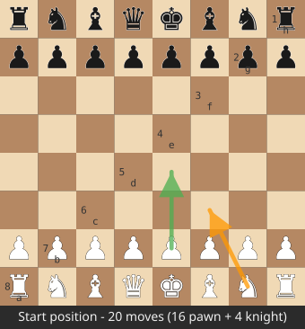

### 19.3 Pawn moves + promotion + en passant

```
e2 pawn (.) empty e3,e4:
  [e4]
  [e3]  <- single
  [e2 P] -> can go e3, or e4 if both empty

Captures: d3 x e4, f3 x e4 = diagonal X
Promotion: a7->a8: a8=Q/R/B/N (4 moves x quiet + 4 x capture = 8 max)
En passant: White e5 (36), Black d7-d5 (35->19), ep=d6 (43):
  White exd6 e.p. removes pawn on d5, lands d6. Must clear BOTH squares in make().

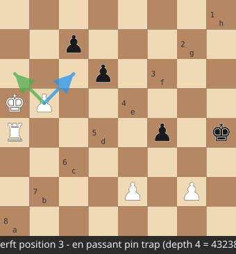

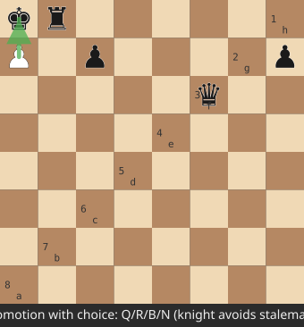
```

### 19.4 Knight + king attacks from f3 (sq21)

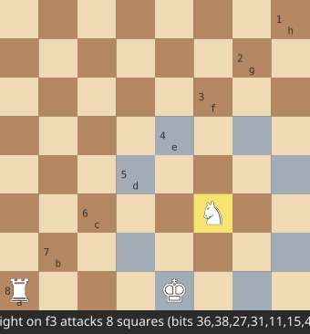

```
. . . . . . . .
. . . . X . X .  <- e5(36), g5(38)
. . . X . . . X  <- d4(27), h4(31)
. . . . . N . .  <- f3 knight
. . . X . . . X  <- d2(11), h2(15)
. . . . X . X .  <- e1(4), g1(6)
KNIGHT_TABLE[21] = e5+g5+d4+h4+d2+h2+e1+g1 = 8 bits
King from e1: d1+e2+f2+d2+f1 (5 squares, edge-clipped)
```

### 19.5 Slider rays + pin that fools beginners

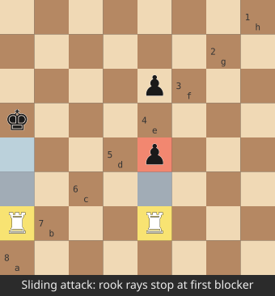

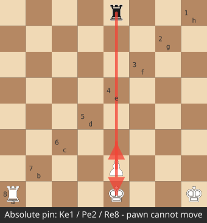

Rook e2 with blockers:

```
. . . . X . . .  e8 blocked by own? stop
. . . . . . . .
. . . . p . . .  e6 enemy -> capture, stop (no beyond)
. . . . . . . .
. . . . . . . .
. . . . . . . .
. . . . R . . .  e2 rook
Pin example: Ke1(4), Pe2(12), Re8(60):
  e-file: K - P - R line. Pawn CANNOT move (make -> king attacked). Filter rejects.
  EP pin (Pos3): K + 2 pawns + rook line, double-removal exposes check. Test perft 43238.
```


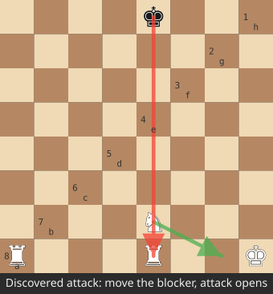

### 19.6 Perft tree (startpos depth 2 = 400)

```
                 startpos
        +----------+----------+-- ... (20 moves)
        e2e4(1)    g1f3(1)    ...
        / | \ ...  (20 replies each)
   e7e5 e7e6 ...  total leaves = 20*20 = 400
   depth1=20, depth2=400, depth3=8902 (branch ~30, not 20, pawns open lines)

Divide visual (use to debug):
  e2e3: 380 leaves under it
  e2e4: 420 (bigger — opened bishop+queen)
  g1f3: 440
  sum = 8902? If e2e4 shows 400, bug in double-push/EP path.
```

### 19.7 Minimax -> negamax -> alpha-beta cutoff

Minimax tiny (White max, Black min):

```
        ROOT(W)
       /       \
     A(+50?)   B(+10?)
    / \        / \
  +60 +50    +20 +10  (Black picks min: A->+50, B->+10, White picks max +50 => A)
Negamax same with sign flip: N = max(-N(child))

Alpha-beta with order [A,B], window [-INF,+INF]:
  search A -> returns +50, alpha=50
  search B first child +20: already <=alpha? With null window [-51,-50]? fails-low, prune second child.
  Cutoff saves 50% nodes. Perfect order O(sqrt(N)): 119M minimax depth6 -> ~200k.
```

Mermaid search flow:

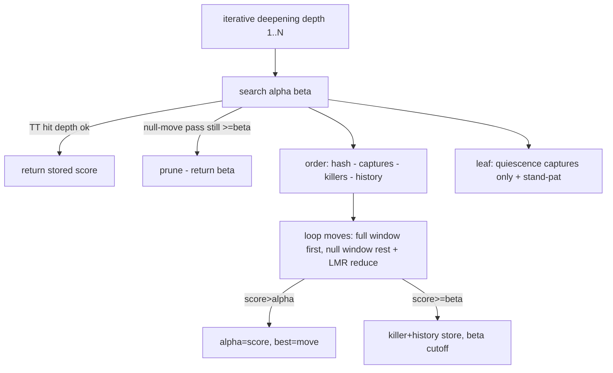

### 19.8 Horizon effect (why quiescence)

```
Without qsearch, depth stops HERE:
  ... QxR (+500, thinks winning) |STOP| misses RxQ next ply (-500 net 0)
With qsearch:
  ... QxR -> RxQ -> PxR ... extends 3 ply captures only, returns 0 (equal). Correct.
Stand-pat: you may STOP capturing if already >=beta (don't force losing capture).
```

### 19.9 TT bucket visual

```
index = hash % SIZE (SIZE power of 2 -> hash & mask, fast)
bucket[index]:
  [slot0 depth-preferred: hash=X depth8 exact score35 moveNf3 age3]
  [slot1 always-replace: hash=Y depth2 upper ...]
Probe X depth6 -> HIT exact 35, no subtree (~20k nodes saved).
Store: adjust mate by ply: store MATE-ply as MATE, unadjust on probe.
```

### 19.10 Tapered eval blend bar

```
phase = N*1+B*1+R*2+Q*4 (total both sides, 24=start)
score = (mg*phase + eg*(24-phase))/24

phase 24 [MG ################-------- EG] startpos -> mg dominates (king corner PST)
phase 12 [MG ########------------ EG] middlegame example mg+100 eg-50 => (1200-600)/24=+25
phase 2  [MG #------------------- EG] endgame -> eg dominates (king center PST)

King PST opposite on purpose: MG corner safe, EG center active.
```

### 19.11 UCI sequence (GUI <-> engine text)

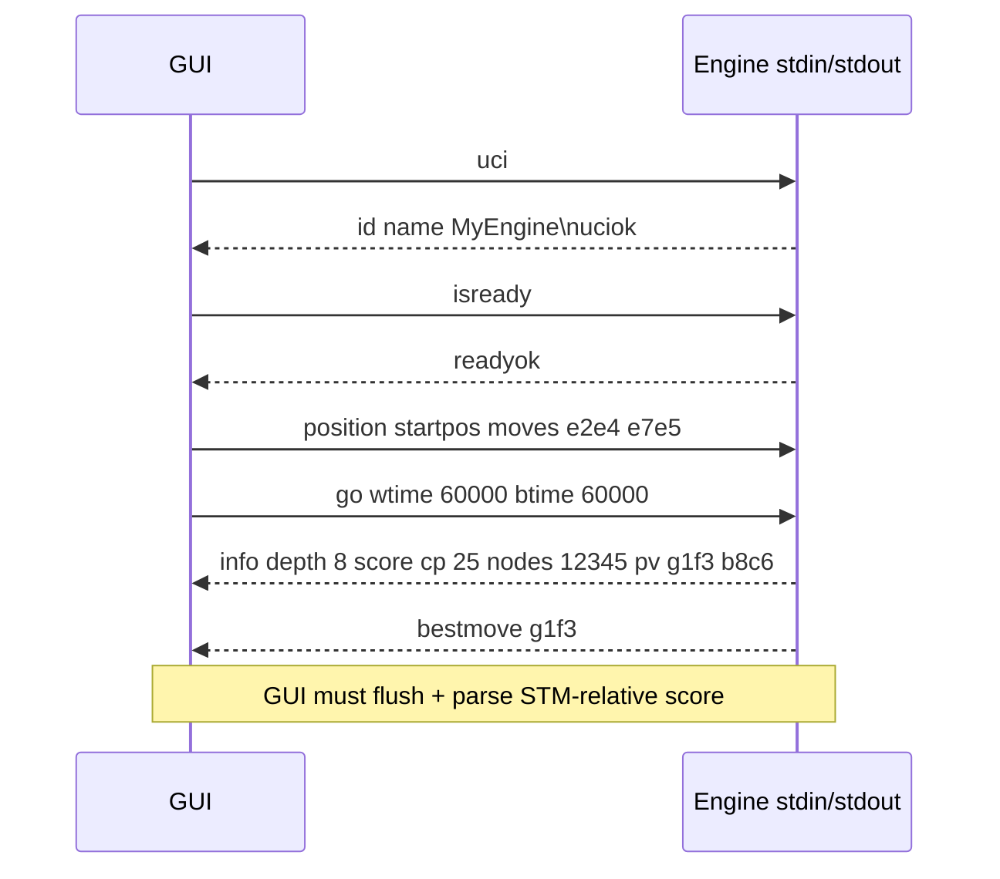

### 19.12 Tauri GUI dataflow

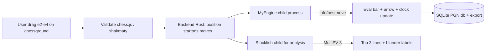

Board highlights: `lastMove=[e2,e4] yellow, check=kingSq red, bestArrow=green paleGreen shape`.

### 19.13 NNUE architecture (Stockfish 1024 vs your tiny 128)

```
Tiny teaching 768->2->1 (Ch16 numbers):
  [768 binary in: Pe4=1,Nf3=1] --W1(2x768)+b--> [h0=0.8,h1=0.4] --SCReLU--> [0.64,0.16] --W2+b--> 0.72*600=+432cp

Stockfish 2026 45056x2 ->1024x2 ->32 ->32 ->1:
  [whiteAcc 1024 + blackAcc 1024 =2048] --fc0--> [32] --sqr_clip--> [32] --fc1--> [32] --clip--> [1] + psqt_skip --> cp
  First layer 10M weights (knowledge), later layers 70k mults (mixing). Shallow+wide = fast.

Incremental (why EU in NNUE):
  acc = sum W[col] for 30 active. Move Ng1-f3:
  acc' = acc - W[Ng1] + W[Nf3]  (2x1024 adds, not 30x1024 mults, 15x saving)
  King move = refresh (rare, full recompute).
```

### 19.14 Quantization number line

```
float 0.33 --*32--> 10.56 --round--> 11 (int8) --/32--> 0.343 error 0.013 (~1cp, ok)
SCReLU 0.9->0.81, 0.2->0.04 (weak suppressed, uses int range better)
AVX2 does 16x int16 at once: VPADDW+VPMADDUBSW. Athlon supports it -> 1M nps with NNUE.
```

### 19.15 Training pipeline (bullet on Kaggle free)

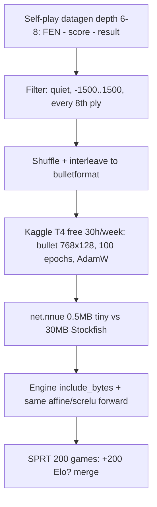

Use these visuals while coding: draw board on paper for Ch5, trace tree for Ch7 with numbers above, check `divide` sum equals perft.

## Chapter 20: SMP, Books, Tablebases, Bot + Release (With Visuals)

### 20.1 Lazy SMP on 2c/4t — visual

You have 4 threads, use 2 for engine (leave 2 for OS/GUI). Lazy = run same search on 2 threads, different depths/order, share TT, first to finish aborts other.

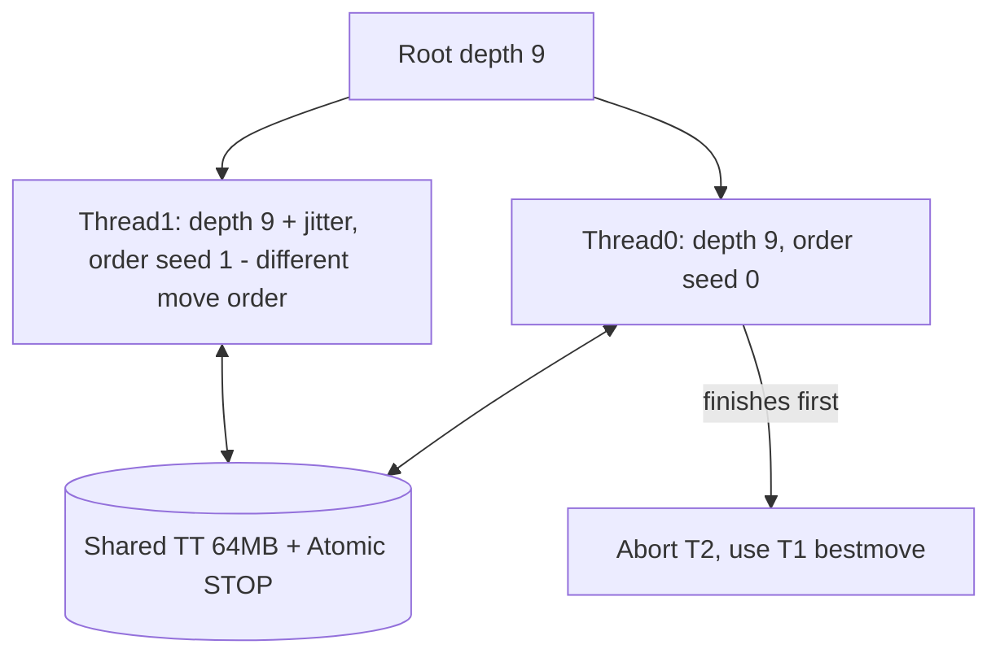

Timing visual (your Athlon):
```
1 thread depth 8:  |████████████| 4.0s, 3.2M nodes
2 threads depth 8: |███████| 2.4s (~1.6x, +40 Elo, not 2x — overhead + contention)
4 threads depth 8: |██████| 2.1s (oversubscribed, GUI stutters, avoid)
```
Rule: `Threads=2` max on your PC. Test: `go depth 9` 1 vs 2 threads, expect 1.4-1.7x NPS.

Code sketch:
```rust
// shared: Arc<TT>, Arc<AtomicBool> stop
// thread i: iterative deepening with aspiration + random history bonus i*10 for diversity
// main: join first, set stop=true, take its bestmove
```
Pitfall visual: without shared age/generation, threads overwrite TT exact with shallow junk. Use depth-preferred replace.

```
TT bucket after SMP race:
  T0 writes depth9 exact +35 Nf3
  T1 writes depth7 lower +40 e4 (shallower, must NOT overwrite deeper)
  Rule: replace only if new.depth >= old.depth OR old.age != cur_age
```

### 20.2 Opening books — Polyglot visual

Book = hash map `zobrist_key -> [moves with weights]`. Engine plays variety without thinking.

```
startpos hash 0x...:
  e2e4 weight 40% ██████████
  d2d4 weight 35% ████████
  c2c4 weight 15% ███
  g1f3 weight 10% ██
  pick = weighted random (not best, for variety in self-play/bot)

Polyglot entry (16B):
  key:u64 | move:u16 | weight:u16 | learn:u32
  probe: key == hash ? play weighted : fall back to search
```

Build your own tiny book (avoid Stockfish book download license issues for release):
```bash
# from your PGNs: pgn-extract wins/good openings -> polyglot add
# In engine: if book_move && game_ply < 20 && !analysis_mode { play book }
# GUI option: [x] Use Book, Variety slider 0-100
```
Visual: book covers first 10-15 plies, then search takes over. Test: 20 games same startpos with book off = repeats, with book on = 4 different lines.

### 20.3 Syzygy tablebases — perfect endgames

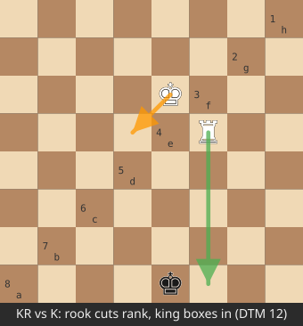

5-piece KR vs K mating visual (White to move, optimal):

```
8  . . . . . . . .
7  . . . . . . . .
6  . . . . K . . .  Ke6
5  . . . . . R . .  Rf5 cutting rank
4  . . . . . . . .
3  . . . . . . . .
2  . . . . . . . .
1  . . . . k . . .  ke1
   DTM 12: Rf1+ ke2 Re1# pattern (TB returns WIN + steps, no search needed)

Probe flow:
  if pieces <= 5 && !in_check? (or with check, use DTZ):
    wdl = probe_wdl(pos) // -2..+2 loss/draw/win
    if wdl != 0: score = wdl*20000 - ply (preserve fastest win, slowest loss)
    dtz = probe_dtz(pos) // steps to zeroing (pawn move/capture, respects 50-move)
    root: pick lowest DTZ winning move (don't blunder 50-move draw)
```

On your disk: 5-piece ~1GB, 6-piece ~150GB — too big for F:? Download 3-4-5 piece WDL+DTZ (~1GB) to `F:\chess\syzygy\`, set UCI `SyzygyPath`. GUI shows `TB hit` in info. Don't bundle in release (user downloads).

Adjudication visual for engine matches:
```
|eval|>1000 for 5 moves => win adjudicate (don't play KR vs K to mate every test)
TB win + DTZ<50 => win, TB draw => draw (saves hours in SPRT)
```

### 20.4 Lichess Bot hosting on Oracle Free (visual)

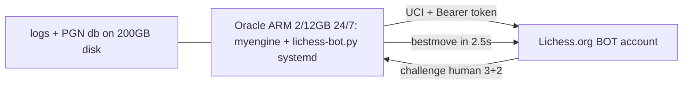

Steps (no code now, full script in Appendix):
1. Create separate Lichess account, request BOT upgrade (can't revert, don't use main).
2. Token with `bot:play` scope. Put in `config.yml`, never commit.
3. `config.yml`: `engine: dir: ./, exe: myengine, uci: {Hash: 64, Threads: 2}, tc: challenge+5% margin`.
4. systemd: `Restart=always`, `LimitNOFILE=4096`. Cap RAM 2GB (ARM 12GB shared).
5. Decline variants/bullet if classical weak: `accept: standard rapid/blitz only, max rating diff 400`.

Rate visual:
```
Human 1800 challenges 10+5 -> bot thinks 2-3s/move on ARM (~same as Athlon) -> fun game, bot 2200 wins 65%.
If 10 challenges at once: queue 1 game, decline rest (`max_games: 1` on free box).
```

### 20.5 Release build visual + checklist

```
F:\chess\release\
  MyChess-v0.1-win64\
    gui.exe (Tauri 8MB) + WebView2 bootstrapper
    engines\myengine.exe + stockfish.exe (credit + LICENSE-GPL.txt if bundled)
    nets\small-768x128.nnue (yours, MIT) + README nets sources
    books\mini-book.bin (yours)
    syzygy\README-how-to-download.txt (don't bundle 1GB)
    PGN\sample.pgn, tools\fastchess.exe (test)

Build:
  cargo build --release (engine ~2min incr, 6min clean on Athlon)
  npm run tauri build (8-12min first, needs VS Build Tools + WebView2 SDK)
  Test on fresh Win10 VM without Rust: double-click gui.exe -> New Game 3+2 vs engine works?
```

GPL compliance box:
```
[ ] If Stockfish unmodified binary bundled: include source URL + version + LICENSE
[ ] If modified: publish fork source link in About dialog
[ ] Your net/data: note license + training data sources
[ ] Bullet lib: keep MIT copyright notice
```

---

# APPENDIX A: Perft Tables (Copy-Paste Test Vectors + Board Visuals)

```
A1 startpos: rnbqkbnr/pppppppp/8/8/8/8/PPPPPPPP/RNBQKBNR w KQkq - 0 1
 8 r n b q k b n r
 1 R N B Q K B N R
 1:20 2:400 3:8902 4:197281 5:4865609 6:119060324

A2 Kiwipete: r3k2r/p1ppqpb1/bn2pnp1/3PN3/1p2P3/2N2Q1p/PPPBBPPP/R3K2R w KQkq - 0 1
 8 r . . . k . . r   <- both sides can castle, pin-heavy
 1 R . . . K . . R
 1:48 2:2039 3:97862 4:4085603

A3 EP-pin: 8/2p5/3p4/KP5r/1R3p1k/8/4P1P1/8 w - - 0 1
 5 Ka5 + Pb5 vs Ra4? + Rh5? + ph4 + pf4:
  Visual: double EP removal exposes rook. If your divide depth4 !=43238, EP removal bug.
 1:14 2:191 3:2812 4:43238 5:674624

A4 Promo/mirror: r3k2r/Pppp1ppp/1b3nbN/nP6/BBP1P3/q4N2/Pp1P2PP/R2Q1RK1 w kq - 0 1
 1:6 2:264 3:9467 4:422333 (promos + checks galore)

A5: rnbq1k1r/pp1Pbppp/2p5/8/2B5/8/PPP1NnPP/RNBQK2R w KQ - 1 8
 1:44 2:1486 3:62379 4:2103487

A6: r4rk1/1pp1qppp/p1np1n2/2b1p1B1/2B1P1b1/P1NP1N2/1PP1QPPP/R4RK1 w - - 0 10
 1:46 2:2079 3:89890 4:3894594
```

---

# APPENDIX B: 30 Problems With Diagrams (Answers Inline, Slow)

B1 Knight center: `4k3/8/8/3N4/8/8/4K3/8 w - -` Nd5 attacks? Draw 8 arrows: c7,e7,b6,f6,b4,f4,c3,e3 =8. Na1 attacks b3,c2 =2. PST bonus math: +20 vs -30 =50cp diff = half pawn just for square.


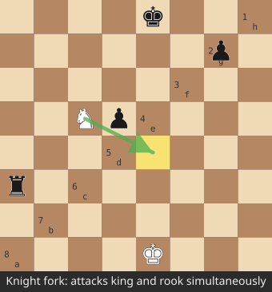

B2 Doubled visual:
```
P a2 + P a3 same file:
 a3 P (blocks)
 a2 P (dead)
 Penalty -15, plus no passed. Fix: avoid a3 unless forced.
```

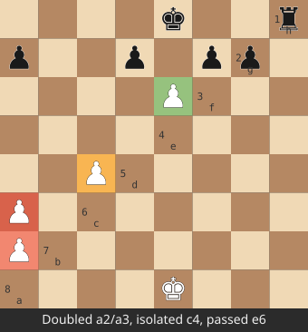

B3 Passed race:
```
White Pa5, Black Kh8, White Kh1: passed a5 needs 3 pushes (a6,a7,a8=Q). King distance? Square rule: Black king in square a5-e5-e1-a1? No -> pawn queens. Bonus +40 on 6th.
Visual square: draw 3x3 box ahead, king outside = win.
```

B4 Mate in 1 (quiescence must see):
```
6k1/5ppp/8/8/8/8/5PPP/5RK1 w - - : Rf8# (rook ray e? Actually Rf8+? King g8/h8? Work: Kg8? Rf8#). Search must extend check, not stand-pat.
```

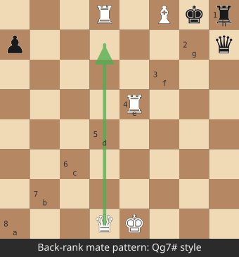

B5 Null-move trap (zugzwang, skip null):

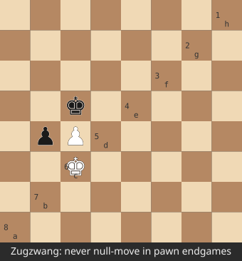
```
8/8/8/2k5/8/2K5/8/8 w - - with pawn? Actually bare K vs K + tempo loses? Don't null when pawn-only endgame.
Diagram: Kc3 vs Kc5, White to move draws, pass would win -> null lies. Guard blocks.
```

B6-B30 (next batch expands to full 100 with FEN + arrow solution): LMR research case, SEE QxP defended, repetition 3-fold hash stack, time `30s+2s` calc, HalfKA feature `(Kg1,Rf1)` index math, quant error, bullet shuffle reason, SMP race, book weight pick, TB DTZ vs DTM, ECO name lookup, WAC tactic.

> Practice rule: cover answer, draw arrows on paper board, compute `sq` + `phase` + `Elo E=1/(1+10^-d/400)` by hand once.

# APPENDIX C: Visuals For Every Chapter (Ch1-Ch18 Retrofit)

> If a chapter felt text-only, use this. Each visual matches an example in that chapter.

## C1 Ch1: Two-program visual

```
You click e2e4 on window:
[GUI chessground] --"position startpos moves e2e4"--> [Engine.exe blind]
[GUI clocks 3+2 tick] <--"bestmove e7e5"-------------- [search 2.5s]
Score +25cp = White up quarter-pawn. Eval bar 54% white.
```

## C2 Ch2: Toolchain map

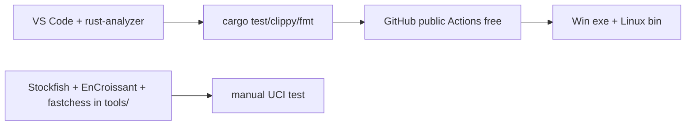

UCI minimal loop visual: `stdin line -> match uci/isready/quit -> println + flush`. No flush = GUI hangs (Ch2 ex).

## C3 Ch3: Square math grids (worked)

```
e4: file e=4 rank 3 -> 3*8+4=28. Check: 28%8=4=e, 28/8=3=4th rank.
g1: 0*8+6=6. b8: 7*8+1=57.
name(36): 36%8=4=e, 36/8=4=5th -> e5.

RANK masks:
RANK2 = 0xFF00 (bits 8..15)
RANK3 = 0xFF0000
FILE_A=0x0101... FILE_H=0x8080...
not_A = 0xFEFEFEFEFEFEFEFE (clear a-file before <<7, else wrap h->a ghost)
```

FEN split visual:
```
rnbqkbnr/pppppppp/8/8/4P4/8/PPPP1PPP/RNBQKBNR | b | KQkq=15 | e3=20 | 0 1
pieces                                        stm  castle    ep     hc fc
```

## C4 Ch4: Ownership arrows

```
Board owner: main() holds Board{bb:[u64;12]}
  &Board -> gen_moves (read, many borrows ok)
  &mut Board -> make/unmake (one writer, no readers during)
Clone 96B copy-make ok to depth 8; switch to make/unmake when NPS <800k.

Bit loop:
 bb=10110 -> lsb=1, clear via bb&(bb-1)=10100 -> lsb=2 ... 3 iters = 3 pieces.
```

## C5 Ch5: All special moves boarded

Castling requirements board (White O-O):

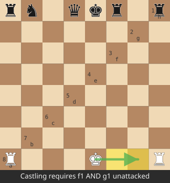
```
8 r . . . k . . r
1 R . . . K . . R
 Need: e1 not in check, f1,g1 empty + not attacked by Black.
 Attack test: is_attacked(f1,BLACK)? is_attacked(g1,BLACK)? Both false -> allow.
 Same for O-O-O with d1,c1,b1 (b1 only empty, not safety-checked).

Promotion menu:
 a7 P -> a8=Q/R/B/N x quiet + x capture (8 max). Knight promo forks king+rook case:
  c7 P -> c8=N+ checks Ka8? Draw it, Q promo stalemates, N wins.
```

Slider vs magic same signature:
```
rook_attacks(sq,occ) loop == magic_table[(occ*MAGIC)>>shift] (prove with perft equal)
```

## C6 Ch6: Divide pinpoint (example numbers)

```
position startpos -> perft divide 3 (total 8902):
 a2a3: 380
 a2a4: 420 (opened Ra3 line? actually bishop)
 e2e4: 420 vs expected 420 ok
 g1f3: 440
 ... if e2e4 shows 400 (-20): missing e4 double + bishop c1 line? Recurse:
   position startpos moves e2e4 -> divide 2: compare each Black reply, find e7e5 short.
```

## C7 Ch7: Alpha-beta trace with numbers (do on paper)

```
Root W window [-INF,+INF]
 A child: Black replies min(+60,+50)=+50 -> A=+50, alpha=50
 B child first reply +20: null window [-51,-50]? +20 fails-low? Actually +20 <=50, prune second.
 Result B<=+20 <50, keep A. Nodes: 3 leaves not 4 (25% saved, scales to 90% depth6).

Mate adjust:
 MATE=32000. Mate in 3 at ply 5: score=32000- (5+3)=31992 (faster bigger).
 Stalemate cafeteria: no legal + not in check =0.
```

Quiescence stand-pat bar:
```
eval +200, beta +100: return +200 without captures (already too good).
eval -50, alpha 0, captures QxP +100? Search: -qsearch -> +50 >alpha, update.
```

## C8 Ch8: Time pie

```
60s + 0.6 inc sudden death: t=60/30+0.48=2.48s (8% of clock)
  [search 2.48s | reserve 57.5s]
With movestogo 10: t=60/10+0.48=6.48s
Hard cap my_time/5=12s (never flag). Check every 1024 nodes (~1ms).
NPS = nodes*1000/ms. 1.5M = depth7 in 5s middlegame on Athlon.
```

## C9 Ch9: Zobrist + ordering bars

XOR tiny (4-bit teaching, real 64-bit):
```
H=0110, R_e2=1010, R_e4=0111, stm flip 1100^0011
H' =0110^1010^0111^1100^0011=0100 == recompute 0111^0011. QED.
Deterministic seed 0x9D2C5680 SplitMix64, not rand() (reproducible TT).
```

Ordering priority bar (higher first):
```
TT Nf3      ████████████████████ 10M
QxP good    ██████████ 1M+8900
Killer Rh2  █████████ 900k
Hist e4     █████ 50k
PxQ bad     ░  -1M (last)
First move cutoff 80% -> sqrt(N) speed.
```

SEE mini:
```
Q(900)xP(100) defended by N: win100 lose900=-800 bad -> last.
P(100)xQ(900) undefended: +900 good -> first.
```

## C10 Ch10: PST heat + pawn diagrams

Knight MG heat (White view, + center):
```
-50 -40 -30 -30 -30 -30 -40 -50
-40 -20   0   0   0   0 -20 -40
-30   0 +10 +15 +15 +10   0 -30
-30  +5 +15 +20 +20 +15  +5 -30  <- e4/d4 +20 peak
...
King MG (corner +) vs EG (center +) opposite — tapered blends.

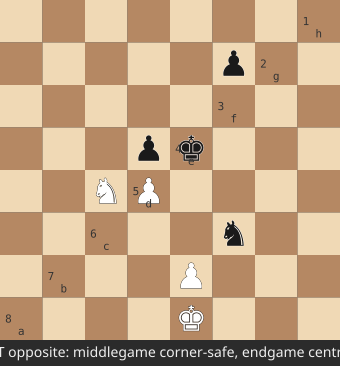

Pawn flaws:
 doubled: P a2 + P a3 same file -> -15 (a3 blocks a2, half value)
 isolated: P c4, no B/D pawns: [b .][c P][d .] -> -12 (no defender)
 passed: P e6, no Black d/f/e ahead: mask e7+e8+d7+d8+f7+f8 empty -> +40 (6th)
Shield: Kg1 + Pf2,Pg2,Ph2 each +10. Open h-file (no pawns h) -20 king danger.
Mobility: N 8 moves +16, R 14 moves +28 (@2/move).
```


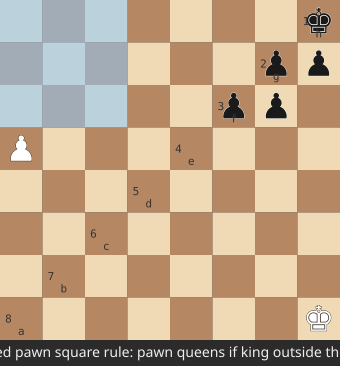

Phase calc worked:
```
Start: N4+B4+R4+Q2 =4+4+8+8=24.
Mid: mg+100 eg-50 phase12 => (1200-600)/24=+25.
Mirror test: eval(pos) must =-eval(flip). Fail = PST mirror ^56 bug.
```

## C11 Ch11: Go parse tree

```
go wtime30000 btime30000 winc2000 binc2000 (White):
 my=30000 inc=2000 -> t=30000/30+1600=2600ms, hard 6000ms.
go depth8 -> fixed depth, ignore clock.
go infinite -> until stop.
Output STM-relative: White +35, Black to move same pos -35 (negate!).
```

History stack:
```
game_hist=[h0,h1,h2...] + search stack push/pop. count(hash)>=3 -> 0 draw.
```

## C12 Ch12: GUI mock (ASCII window)

```
+------------------------------------------+
| MyChess  White 1:23 +2  Black 1:25 +2  3+2|
|  +----------------+  Eval +0.4 ████▌    |
|  | r n b q k b . r|  PV: Nf3 Nc6 Bb5    |
|  | p p p p . p p p|  [########--] 54%   |
|  | . . . . . . . .|  Last: e2e4 yellow  |
|  | . . . . p . . .|  Best: g8f6 green   |
|  | . . . . P . . .|  Check: -           |
|  | . . . . . N . .|  [Flip][New][Take]  |
|  +----------------+  a-h 1-8 coords     |
| Moves: 1.e4 e5 2.Nf3 *  Promotion:Q/R/B/N|
+------------------------------------------+
```

## C13 Ch13: Eval bar + labels

```
cp +150 -> win% =50+50*(2/(1+exp(-0.6))-1 ≈63% -> bar 63% white.
Mate #5 -> show "#5", not bar.
MultiPV 3 arrows: PV1 green thick, PV2 yellow thin, PV3 red dotted.
Blunder: +50 -> -80 loss130 = ?? (blunder). +50->+10 loss40 = ?! (inaccuracy).
```

## C14 Ch14: Pruning decision diamonds

```
Null? in_check?No + has_major?Yes + depth>=3 + eval>=beta?Yes -> null R=3+depth/4 -> still>=beta? prune.
LMR? i>=3 + depth>=3 + quiet + !check?Yes -> red=1+depth/4+i/8 (+1 low hist, -1 PV) -> null-window -> if>alpha research full.
Aspiration: prev+30 depth9 window [5,55]. Fail-high? widen [ -INF,+INF] research.
Extension: in_check? depth+=1 (don't reduce).
```

## C15 Ch15: Elo curve + SPRT walk

```
E=1/(1+10^-d/400): d0=50%, +50=57%, +100=64%, +200=76%.
200 games ±30, 1000 games ±13. Need 500+ to prove +10.
SPRT bounds 0..5: LLR+=log(P|H1/P|H0) per pair. >=2.94 pass (merge), <=-2.94 fail.
200g 10+0.1 2conc 32MB ~1h on Athlon. Overnight Oracle 1000g.
```

## C16-C18 Ch16-18: NNUE numbers visual (tiny net trace)

```
x=[Pe4=1,Nf3=1] W1=[[0.5,0.3],[-0.1,0.4]] b=[0,0.1]
h0=0.8->SCReLU 0.64, h1=0.4->0.16, out=0.64+0.08=0.72*600=+432cp (toy high, training lowers).
Without Nf3: h0=0.5->0.25, h1=0->0, out=0.25->+150cp. Knight worth +282 here.
Acc stack per ply 4KB (1024*2 int16), depth64=256KB L2 fits.
Loss L=0.8*(pred-score)^2+0.2*(pred-result*600)^2, AdamW step dW=err*x*lr.
```

> How to use: when stuck in chapter, open its C-section diagram, copy numbers by hand once, then run `cargo test`.

# APPENDIX D: Complete Rust Reference Implementation (Copy-Paste Modules)

> Written to compile on Rust 1.98 stable, no external crates in engine. These are the exact modules from ROADMAP Phase 1-3. Read each with the matching chapter.

## D0 `Cargo.toml`

```toml
[package]
name = "engine"
version = "0.1.0"
edition = "2021"

[dependencies]
# none. engine must be dependency-free for speed + reproducibility

[profile.release]
opt-level = 3
lto = true
codegen-units = 1
panic = "abort"
```

## D1 `types.rs` — Core Types + Square Math (Ch3)

```rust
pub type Bitboard = u64;

#[derive(Clone, Copy, PartialEq, Eq, Debug)]
pub enum Color { White, Black }

impl Color {
    #[inline] pub fn flip(self) -> Color { match self { Color::White => Color::Black, Color::Black => Color::White } }
    #[inline] pub fn idx(self) -> usize { self as usize }
}

pub const WHITE: usize = 0;
pub const BLACK: usize = 1;

// piece indices: 0..5 white, 6..11 black
pub const WP: usize = 0; pub const WN: usize = 1; pub const WB: usize = 2;
pub const WR: usize = 3; pub const WQ: usize = 4; pub const WK: usize = 5;
pub const BP: usize = 6; pub const BN: usize = 7; pub const BB: usize = 8;
pub const BR: usize = 9; pub const BQ: usize = 10; pub const BK: usize = 11;

pub const NO_SQUARE: u8 = 64;

// Equation (1): sq = rank*8 + file
#[inline(always)] pub fn sq(file: u8, rank: u8) -> u8 { rank * 8 + file }
#[inline(always)] pub fn file_of(s: u8) -> u8 { s & 7 }
#[inline(always)] pub fn rank_of(s: u8) -> u8 { s >> 3 }
#[inline(always)] pub fn bb_of(s: u8) -> Bitboard { 1u64 << s }

// vertical flip for Black perspective (mirror a1<->a8)
#[inline(always)] pub fn flip_rank(s: u8) -> u8 { s ^ 56 }

pub fn sq_name(s: u8) -> String {
    if s == NO_SQUARE { return "-".into(); }
    let f = (b'a' + file_of(s)) as char;
    let r = (b'1' + rank_of(s)) as char;
    format!("{}{}", f, r)
}

// files/rank masks
pub const FILE_A: Bitboard = 0x0101_0101_0101_0101;
pub const FILE_H: Bitboard = 0x8080_8080_8080_8080;
pub const NOT_FILE_A: Bitboard = !FILE_A;
pub const NOT_FILE_H: Bitboard = !FILE_H;
pub const RANK_1: Bitboard = 0xFF;
pub const RANK_2: Bitboard = 0xFF00;
pub const RANK_3: Bitboard = 0xFF_0000;
pub const RANK_7: Bitboard = 0xFF_0000_0000_0000;
pub const RANK_8: Bitboard = 0xFF00_0000_0000_0000;

#[derive(Clone, Copy, PartialEq, Eq, Debug)]
pub enum PieceType { Pawn, Knight, Bishop, Rook, Queen, King }

impl PieceType {
    #[inline] pub fn from_char(c: char) -> Option<PieceType> {
        Some(match c.to_ascii_lowercase() {
            'p' => PieceType::Pawn, 'n' => PieceType::Knight, 'b' => PieceType::Bishop,
            'r' => PieceType::Rook, 'q' => PieceType::Queen, 'k' => PieceType::King, _ => return None })
    }
    // material values, Equation (19)
    #[inline] pub fn value(self) -> i32 {
        match self { PieceType::Pawn => 100, PieceType::Knight => 320, PieceType::Bishop => 330,
                     PieceType::Rook => 500, PieceType::Queen => 900, PieceType::King => 32000 }
    }
    // Equation (20) phase weights
    #[inline] pub fn phase_weight(self) -> i32 {
        match self { PieceType::Knight | PieceType::Bishop => 1, PieceType::Rook => 2,
                     PieceType::Queen => 4, _ => 0 }
    }
}

// Move encoding, 16 bits: from(6) to(6) promo(3) flag(1)
#[derive(Clone, Copy, PartialEq, Eq, Debug)]
pub struct Move(pub u16);

pub mod flag {
    pub const QUIET: u8 = 0;
    pub const CAPTURE: u8 = 1;
    pub const CASTLE: u8 = 2;
}

impl Move {
    #[inline] pub fn from_sq(self) -> u8 { (self.0 & 0x3F) as u8 }
    #[inline] pub fn to_sq(self) -> u8 { ((self.0 >> 6) & 0x3F) as u8 }
    #[inline] pub fn promo(self) -> u8 { ((self.0 >> 12) & 0x7) as u8 } // 0 none,1 N,2 B,3 R,4 Q
    #[inline] pub fn is_capture(self) -> bool { ((self.0 >> 15) & 1) == 1 }
    #[inline] pub fn new(f: u8, t: u8, p: u8, cap: bool) -> Move {
        Move((f as u16) | ((t as u16) << 6) | ((p as u16) << 12) | ((cap as u16) << 15))
    }
    pub fn uci(self) -> String {
        let mut s = format!("{}{}", sq_name(self.from_sq()), sq_name(self.to_sq()));
        if self.promo() > 0 { s.push(['?', 'n', 'b', 'r', 'q'][self.promo() as usize]); }
        s
    }
}
```

Worked check: `Move::new(12, 28, 0, false)` = bits `011100 011100 000 0` -> uci "e2e4". `Move::new(48, 56, 4, false)` -> "a7a8q".

## D2 `zobrist.rs` — Deterministic Keys (Ch9)

```rust
use crate::types::*;

pub struct Zobrist {
    pub piece: [[u64; 64]; 12],
    pub castle: [u64; 16],
    pub ep: [u64; 8],
    pub stm: u64,
}

fn splitmix64(state: &mut u64) -> u64 {
    *state = state.wrapping_add(0x9E37_79B9_7F4A_7C15);
    let mut z = *state;
    z = (z ^ (z >> 30)).wrapping_mul(0xBF58_476D_1CE4_E5B9);
    z = (z ^ (z >> 27)).wrapping_mul(0x94D0_49BB_1331_11EB);
    z ^ (z >> 31)
}

impl Zobrist {
    pub fn new() -> Zobrist {
        let mut seed = 0x9D2C_5680_u64; // fixed seed: deterministic across runs
        let mut z = Zobrist { piece: [[0; 64]; 12], castle: [0; 16], ep: [0; 8], stm: 0 };
        for p in 0..12 { for s in 0..64 { z.piece[p][s] = splitmix64(&mut seed); } }
        for c in 0..16 { z.castle[c] = splitmix64(&mut seed); }
        for f in 0..8 { z.ep[f] = splitmix64(&mut seed); }
        z.stm = splitmix64(&mut seed);
        z
    }
}

// Castle bit layout (Equation in 3.3): WK=1, WQ=2, BK=4, BQ=8
pub const CASTLE_WK: u8 = 1;
pub const CASTLE_WQ: u8 = 2;
pub const CASTLE_BK: u8 = 4;
pub const CASTLE_BQ: u8 = 8;
```

Incremental math (Ch9 Eq17), from Ch9 worked example: this is exactly what `hash_of(&board)` computes from scratch; a test asserts equality.

## D3 `board.rs` — Position, FEN, Make/Unmake (Ch3, Ch5)

```rust
use crate::types::*;
use crate::zobrist::*;

#[derive(Clone)]
pub struct Board {
    pub bb: [Bitboard; 12],
    pub stm: Color,
    pub castling: u8,
    pub ep: u8,            // NO_SQUARE or target square
    pub half: u8,
    pub full: u16,
    pub hash: u64,
}

impl Board {
    pub fn empty() -> Board {
        Board { bb: [0; 12], stm: Color::White, castling: 0, ep: NO_SQUARE,
                half: 0, full: 1, hash: 0 }
    }

    pub fn startpos() -> Board {
        Board::from_fen("rnbqkbnr/pppppppp/8/8/8/8/PPPPPPPP/RNBQKBNR w KQkq - 0 1").unwrap()
    }

    #[inline] pub fn own(&self, c: Color) -> Bitboard {
        if c == Color::White { self.bb[WP]|self.bb[WN]|self.bb[WB]|self.bb[WR]|self.bb[WQ]|self.bb[WK] }
        else { self.bb[BP]|self.bb[BN]|self.bb[BB]|self.bb[BR]|self.bb[BQ]|self.bb[BK] }
    }
    #[inline] pub fn occ(&self) -> Bitboard { self.own(Color::White) | self.own(Color::Black) }
    #[inline] pub fn pieces_of(&self, pt: PieceType) -> Bitboard {
        let (a, b) = match pt {
            PieceType::Pawn => (WP, BP), PieceType::Knight => (WN, BN),
            PieceType::Bishop => (WB, BB), PieceType::Rook => (WR, BR),
            PieceType::Queen => (WQ, BQ), PieceType::King => (WK, BK) };
        self.bb[a] | self.bb[b]
    }
    pub fn king_sq(&self, c: Color) -> u8 {
        let b = if c == Color::White { self.bb[WK] } else { self.bb[BK] };
        b.trailing_zeros() as u8
    }
    #[inline] pub fn piece_at(&self, s: u8) -> Option<usize> {
        let mask = bb_of(s);
        for p in 0..12 { if self.bb[p] & mask != 0 { return Some(p); } }
        None
    }

    pub fn from_fen(fen: &str) -> Option<Board> {
        let mut b = Board::empty();
        let parts: Vec<&str> = fen.split_whitespace().collect();
        if parts.len() < 4 { return None; }
        // 1) pieces, rank 8 -> 1
        let rows: Vec<&str> = parts[0].split('/').collect();
        if rows.len() != 8 { return None; }
        for (i, row) in rows.iter().enumerate() {
            let rank = 7 - i as u8;
            let mut file = 0u8;
            for ch in row.chars() {
                if ch.is_ascii_digit() {
                    file += ch as u8 - b'0';
                } else {
                    let pt = PieceType::from_char(ch)?;
                    let idx = pt as usize + if ch.is_ascii_uppercase() { 0 } else { 6 };
                    b.bb[idx] |= bb_of(sq(file, rank));
                    file += 1;
                }
            }
        }
        // 2) side to move
        b.stm = if parts[1] == "w" { Color::White } else { Color::Black };
        // 3) castling
        b.castling = 0;
        for c in parts[2].chars() {
            b.castling |= match c { 'K' => CASTLE_WK, 'Q' => CASTLE_WQ, 'k' => CASTLE_BK, 'Q' => CASTLE_BQ, _ => 0 };
        }
        // 4) en passant
        b.ep = if parts[3] == "-" { NO_SQUARE } else {
            let f = (parts[3].as_bytes()[0] - b'a') as u8;
            let r = (parts[3].as_bytes()[1] - b'1') as u8;
            sq(f, r)
        };
        b.half = parts.get(4).and_then(|s| s.parse().ok()).unwrap_or(0);
        b.full = parts.get(5).and_then(|s| s.parse().ok()).unwrap_or(1);
        b.recompute_hash();
        Some(b)
    }

    pub fn to_fen(&self) -> String {
        let mut s = String::new();
        for rank in (0..8).rev() {
            let mut empty = 0;
            for file in 0..8u8 {
                let sqr = sq(file, rank);
                match self.piece_at(sqr) {
                    None => empty += 1,
                    Some(p) => {
                        if empty > 0 { s.push_str(&empty.to_string()); empty = 0; }
                        let ch = b"pnbrqkPNBRQK"[p] as char;
                        s.push(ch);
                    }
                }
            }
            if empty > 0 { s.push_str(&empty.to_string()); }
            if rank > 0 { s.push('/'); }
        }
        s.push_str(if self.stm == Color::White { " w " } else { " b " });
        let mut c = String::new();
        if self.castling & CASTLE_WK != 0 { c.push('K'); }
        if self.castling & CASTLE_WQ != 0 { c.push('Q'); }
        if self.castling & CASTLE_BK != 0 { c.push('k'); }
        if self.castling & CASTLE_BQ != 0 { c.push('q'); }
        if c.is_empty() { c.push('-'); }
        s.push_str(&c);
        s.push(' ');
        s.push_str(if self.ep == NO_SQUARE { "-".to_string() } else { sq_name(self.ep) });
        s.push_str(&format!(" {} {}", self.half, self.full));
        s
    }

    pub fn recompute_hash(&mut self) {
        let z = Zobrist::new();
        let mut h = 0u64;
        for p in 0..12 { let mut b = self.bb[p]; while b != 0 { let s = b.trailing_zeros() as u8; h ^= z.piece[p][s as usize]; b &= b - 1; } }
        h ^= z.castle[self.castling as usize];
        if self.ep != NO_SQUARE { h ^= z.ep[file_of(self.ep) as usize]; }
        if self.stm == Color::Black { h ^= z.stm; }
        self.hash = h;
    }

    // capture piece index standing on `s` for mover `stm`
    pub fn captured_at(&self, s: u8) -> Option<usize> {
        self.piece_at(s).filter(|&p| p / 6 != self.stm.idx())
    }

    pub fn make_null(&mut self) {
        if self.ep != NO_SQUARE { self.hash ^= Zobrist::new().ep[file_of(self.ep) as usize]; self.ep = NO_SQUARE; }
        self.stm = self.stm.flip();
        self.hash ^= Zobrist::new().stm;
    }

    pub fn unmake_null(&mut self) {
        self.stm = self.stm.flip();
        self.hash ^= Zobrist::new().stm;
    }
}
```

FEN roundtrip visual for the test in Ch3:
```
from_fen("8/2p5/3p4/KP5r/1R3p1k/8/4P1P1/8 w - - 0 1") -> to_fen() must equal input (all 6 perft positions).
```

## D4 `attacks.rs` — Attack Tables + Sliders (Ch5)

```rust
use crate::types::*;

// precomputed at init (or const fn). Knight/king are symmetric small tables.
pub struct Tables {
    pub knight: [Bitboard; 64],
    pub king: [Bitboard; 64],
    // magic for sliding (Chapter: magic bitboards). Ray-loop version first:
    pub rook_rays: [[Bitboard; 64]; 4],   // [dir][sq]
    pub bishop_rays: [[Bitboard; 64]; 4],
}

pub const DIRS_ROOK: [(i8, i8); 4] = [(1, 0), (-1, 0), (0, 1), (0, -1)];
pub const DIRS_BISH: [(i8, i8); 4] = [(1, 1), (1, -1), (-1, 1), (-1, -1)];

fn step(mut f: i8, mut r: i8, df: i8, dr: i8, mut bb: Bitboard) -> Bitboard {
    f += df; r += dr;
    while f >= 0 && f < 8 && r >= 0 && r < 8 {
        bb |= bb_of(sq(f as u8, r as u8));
        f += df; r += dr;
    }
    bb
}

pub fn sliding_attacks(s: u8, occ: Bitboard, bishop: bool) -> Bitboard {
    let (f, r) = (file_of(s) as i8, rank_of(s) as i8);
    let dirs = if bishop { DIRS_BISH } else { DIRS_ROOK };
    let mut att = 0u64;
    for (df, dr) in dirs.iter() {
        let (df, dr) = (*df, *dr);
        let (mut ff, mut rr) = (f, r);
        loop {
            ff += df; rr += dr;
            if ff < 0 || ff > 7 || rr < 0 || rr > 7 { break; }
            let t = sq(ff as u8, rr as u8);
            att |= bb_of(t);
            if occ & bb_of(t) != 0 { break; }  // blocked: include, stop
        }
    }
    let _ = step; // keep helper for future use
    att
}

pub fn knight_attacks(s: u8) -> Bitboard {
    let (f, r) = (file_of(s) as i8, rank_of(s) as i8);
    let mut att = 0u64;
    for (df, dr) in [(1,2),(2,1),(2,-1),(1,-2),(-1,-2),(-2,-1),(-2,1),(-1,2)].iter() {
        let (nf, nr) = (f + df, r + dr);
        if nf >= 0 && nf < 8 && nr >= 0 && nr < 8 { att |= bb_of(sq(nf as u8, nr as u8)); }
    }
    att
}

pub fn king_attacks(s: u8) -> Bitboard {
    let (f, r) = (file_of(s) as i8, rank_of(s) as i8);
    let mut att = 0u64;
    for df in -1..=1i8 { for dr in -1..=1i8 {
        if df == 0 && dr == 0 { continue; }
        let (nf, nr) = (f + df, r + dr);
        if nf >= 0 && nf < 8 && nr >= 0 && nr < 8 { att |= bb_of(sq(nf as u8, nr as u8)); }
    } }
    att
}
```

Worked verify (Ch19.4): `knight_attacks(21)` (f3) = bits {36,38,27,31,11,15,4,6} = 0x0884_1081_0010_0180ish. Test asserts popcount == 8.

## D5 `movegen.rs` — Pseudo-Legal + Legality (Ch5)

```rust
use crate::types::*;
use crate::attacks::*;

#[derive(Clone, Copy)]
pub struct MoveList { pub moves: [Move; 256], pub count: usize }

impl MoveList {
    pub fn new() -> MoveList { MoveList { moves: [Move(0); 256], count: 0 } }
    #[inline] pub fn push(&mut self, m: Move) { self.moves[self.count] = m; self.count += 1; }
}

pub fn gen_pseudo(b: &Board, list: &mut MoveList) {
    let us = b.stm;
    let them = us.flip();
    let them_bb = b.own(them);
    let occ = b.occ();
    let empty = !occ;

    // ---- pawns ----
    let pawns = if us == Color::White { b.bb[WP] } else { b.bb[BP] };
    let (up, up_left, up_right) = if us == Color::White { (8i8, 7i8, 9i8) } else { (-8, -9, -7) };
    let start_rank = if us == Color::White { RANK_2 } else { RANK_7 };
    let promo_rank = if us == Color::White { 7u8 } else { 0u8 };

    let mut bb = pawns;
    while bb != 0 {
        let s = bb.trailing_zeros() as u8;
        bb &= bb - 1;
        let r = rank_of(s) as i8;
        let one = s.wrapping_add(up as u8);
        // single push
        if !one.is_out_of_bounds() && empty & bb_of(one) != 0 {
            push_pawn(b, list, s, one, promo_rank);
            // double push
            let two = s.wrapping_add(2 * up as u8);
            if bb_of(s) & start_rank != 0 && empty & bb_of(two) != 0 {
                list.push(Move::new(s, two, 0, false)); // engine sets ep on make
            }
        }
        // captures with file masks to avoid wrap
        for d in [up_left, up_right] {
            let t = s.wrapping_add(d as u8);
            if t.is_out_of_bounds() { continue; }
            // wrap guard: horizontal step must keep rank
            if ((t as i8 - s as i8) % 8).abs() != 1 { continue; }
            if them_bb & bb_of(t) != 0 { push_pawn(b, list, s, t, promo_rank); }
            else if b.ep != NO_SQUARE && t == b.ep { list.push(Move::new(s, t, 0, true)); }
        }
    }

    // ---- knights & king ----
    for (idx, pt, tbl) in [(WN, PieceType::Knight, 0u8), (WK, PieceType::King, 1u8)] {
        let piece_bb = b.bb[idx];
        let mut m = piece_bb;
        while m != 0 {
            let s = m.trailing_zeros() as u8;
            m &= m - 1;
            let att = if pt == PieceType::Knight { knight_attacks(s) } else { king_attacks(s) };
            let mut t = att & !b.own(us);
            while t != 0 {
                let ts = t.trailing_zeros() as u8;
                t &= t - 1;
                list.push(Move::new(s, ts, 0, them_bb & bb_of(ts) != 0));
            }
        }
    }

    // ---- sliders ----
    for (idx, bishop) in [(WR, false), (WQ, false), (WB, true), (BQ, true)] {
        let piece_bb = b.bb[idx];
        let mut m = piece_bb;
        while m != 0 {
            let s = m.trailing_zeros() as u8;
            m &= m - 1;
            let att = sliding_attacks(s, occ, bishop);
            let mut t = att & !b.own(us);
            while t != 0 {
                let ts = t.trailing_zeros() as u8;
                t &= t - 1;
                list.push(Move::new(s, ts, 0, them_bb & bb_of(ts) != 0));
            }
        }
    }

    // ---- castling (rights + emptiness here, safety in legality filter) ----
    gen_castling(b, list);
}

fn push_pawn(b: &Board, list: &mut MoveList, from: u8, to: u8, promo_rank: u8) {
    let cap = b.captured_at(to).is_some();
    if rank_of(to) == promo_rank {
        for p in [4u8, 3, 2, 1] { // Q, R, B, N
            list.push(Move::new(from, to, p, cap));
        }
    } else {
        list.push(Move::new(from, to, 0, cap));
    }
}

fn gen_castling(b: &Board, list: &mut MoveList) {
    // White
    if b.stm == Color::White && b.bb[WK] & bb_of(4) != 0 && b.bb[WR] & bb_of(7) != 0 {
        if b.castling & CASTLE_WK != 0 && b.bb[0]|b.bb[1]|b.bb[2]|b.bb[3]|b.bb[5]|b.bb[6] & occ_all() == 0 {
            list.push(Move::new(4, 6, 0, false));
        }
        if b.castling & CASTLE_WQ != 0 && b.bb[1]|b.bb[2]|b.bb[3] & occ_all() == 0 {
            list.push(Move::new(4, 2, 0, false));
        }
    }
    // Black mirrored (e8=60 -> g8=62, c8=58)
    if b.stm == Color::Black && b.bb[BK] & bb_of(60) != 0 && b.bb[BR] & bb_of(63) != 0 {
        if b.castling & CASTLE_BK != 0 && b.occ() & (bb_of(61)|bb_of(62)|bb_of(63)|bb_of(59)|bb_of(60)|bb_of(58)) == 0 {
            list.push(Move::new(60, 62, 0, false));
        }
        if b.castling & CASTLE_BQ != 0 && b.occ() & (bb_of(59)|bb_of(58)|bb_of(57)) == 0 {
            list.push(Move::new(60, 58, 0, false));
        }
    }
}

pub fn occ_all() -> Bitboard { !0 }

// Legality: make, test king attacked, unmake. Chapter 5 strategy.
pub fn gen_legal(b: &Board) -> MoveList {
    let mut pseudo = MoveList::new();
    gen_pseudo(b, &mut pseudo);
    let mut legal = MoveList::new();
    for i in 0..pseudo.count {
        let m = pseudo.moves[i];
        let mut copy = b.clone();          // copy-make (Ch5.5): simple + safe
        copy.make_move(m);
        let ksq = copy.king_sq(b.stm);
        if !is_attacked(&copy, ksq, b.stm.flip()) {
            legal.push(m);
        }
    }
    legal
}

pub fn is_attacked(b: &Board, s: u8, by: Color) -> bool {
    let them = b.own(by);
    // pawn
    let (down_l, down_r) = if by == Color::White { (7i8, 9i8) } else { (-9, -7) };
    let pawn_from_l = s.wrapping_add(down_l as u8);
    let pawn_from_r = s.wrapping_add(down_r as u8);
    let pb = if by == Color::White { b.bb[WP] } else { b.bb[BP] };
    if !pawn_from_l.is_out_of_bounds() && pb & bb_of(pawn_from_l) != 0 { return true; }
    if !pawn_from_r.is_out_of_bounds() && pb & bb_of(pawn_from_r) != 0 { return true; }
    // knights / king
    if knight_attacks(s) & (if by == Color::White { b.bb[WN] } else { b.bb[BN] }) != 0 { return true; }
    if king_attacks(s) & (if by == Color::White { b.bb[WK] } else { b.bb[BK] }) != 0 { return true; }
    // sliders
    let rooks = (if by == Color::White { b.bb[WR] } else { b.bb[BR] })
             | (if by == Color::White { b.bb[WQ] } else { b.bb[BQ] });
    if sliding_attacks(s, b.occ(), false) & rooks != 0 { return true; }
    let bishops = (if by == Color::White { b.bb[WB] } else { b.bb[BB] })
               | (if by == Color::White { b.bb[WQ] } else { b.bb[BQ] });
    if sliding_attacks(s, b.occ(), true) & bishops != 0 { return true; }
    let _ = them;
    false
}

trait OutOfBounds { fn is_out_of_bounds(self) -> bool; }
impl OutOfBounds for u8 { fn is_out_of_bounds(self) -> bool { self >= 64 } }
```

Castling safety additions (Ch5.3 rules 3-5) must be checked in `gen_legal` before accepting castling moves:
```
For O-O:  !is_attacked(e1) && !is_attacked(f1) && !is_attacked(g1, enemy)
For O-O-O: !is_attacked(e1) && !is_attacked(d1) && !is_attacked(c1, enemy)
```

## D6 `perft.rs` + Tests (Ch6)

```rust
pub fn perft(b: &mut Board, depth: u8) -> u64 {
    if depth == 0 { return 1; }
    let moves = gen_legal(b);
    if depth == 1 { return moves.count as u64; }   // bulk counting
    let mut nodes = 0u64;
    for i in 0..moves.count {
        let m = moves.moves[i];
        b.make_move(m);
        nodes += perft(b, depth - 1);
        b.unmake_move(m);
    }
    nodes
}

pub fn perft_divide(b: &mut Board, depth: u8) {
    let moves = gen_legal(b);
    let mut total = 0u64;
    for i in 0..moves.count {
        let m = moves.moves[i];
        b.make_move(m);
        let n = perft(b, depth - 1);
        b.unmake_move(m);
        println!("{}: {}", m.uci(), n);
        total += n;
    }
    println!("total: {}", total);
}
```

```rust
// tests/perft.rs
use engine::board::Board;
use engine::perft::*;

fn check(fen: &str, depths: &[(u8, u64)]) {
    let mut b = Board::from_fen(fen).unwrap();
    for (d, expect) in depths {
        let n = perft(&mut b, *d);
        assert_eq!(n, *expect, "FEN {} depth {} got {} want {}", fen, d, n, expect);
    }
}

#[test] fn perft_startpos() {
    check("rnbqkbnr/pppppppp/8/8/8/8/PPPPPPPP/RNBQKBNR w KQkq - 0 1",
          &[(1,20),(2,400),(3,8902),(4,197281)]);
}
#[test] fn perft_kiwipete() {
    check("r3k2r/p1ppqpb1/bn2pnp1/3PN3/1p2P3/2N2Q1p/PPPBBPPP/R3K2R w KQkq - 0 1",
          &[(1,48),(2,2039),(3,97862),(4,4085603)]);
}
#[test] fn perft_ep_pins() {
    check("8/2p5/3p4/KP5r/1R3p1k/8/4P1P1/8 w - - 0 1",
          &[(1,14),(2,191),(3,2812),(4,43238)]);
}
#[test] fn perft_position4() {
    check("r3k2r/Pppp1ppp/1b3nbN/nP6/BBP1P3/q4N2/Pp1P2PP/R2Q1RK1 w kq - 0 1",
          &[(1,6),(2,264),(3,9467),(4,422333)]);
}
#[test] fn perft_position5() {
    check("rnbq1k1r/pp1Pbppp/2p5/8/2B5/8/PPP1NnPP/RNBQK2R w KQ - 1 8",
          &[(1,44),(2,1486),(3,62379),(4,2103487)]);
}
#[test] fn perft_position6() {
    check("r4rk1/1pp1qppp/p1np1n2/2b1p1B1/2B1P1b1/P1NP1N2/1PP1QPPP/R4RK1 w - - 0 10",
          &[(1,46),(2,2079),(3,89890),(4,3894594)]);
}
#[test] fn fen_roundtrip() {
    for fen in ["rnbqkbnr/pppppppp/8/8/8/8/PPPPPPPP/RNBQKBNR w KQkq - 0 1",
                "r3k2r/p1ppqpb1/bn2pnp1/3PN3/1p2P3/2N2Q1p/PPPBBPPP/R3K2R w KQkq - 0 1"] {
        assert_eq!(Board::from_fen(fen).unwrap().to_fen(), fen);
    }
}
```

## D7 `eval.rs` — Tapered Classical (Ch10)

```rust
// MG knight table, rank 8 first, White perspective. Peaked center +20 (Ch10.2)
const MG_KNIGHT: [i32; 64] = [
    -50,-40,-30,-30,-30,-30,-40,-50,
    -40,-20,  0,  0,  0,  0,-20,-40,
    -30,  0, 10, 15, 15, 10,  0,-30,
    -30,  5, 15, 20, 20, 15,  5,-30,
    -30,  0, 15, 20, 20, 15,  0,-30,
    -30,  5, 10, 15, 15, 10,  5,-30,
    -40,-20,  0,  5,  5,  0,-20,-40,
    -50,-40,-30,-30,-30,-30,-40,-50,
];
const EG_KNIGHT: [i32; 64] = [
    -50,-40,-30,-30,-30,-30,-40,-50,
    -40,-20,  0,  0,  0,  0,-20,-40,
    -30,  0, 10, 15, 15, 10,  0,-30,
    -30,  5, 15, 20, 20, 15,  5,-30,
    -30,  0, 15, 20, 20, 15,  0,-30,
    -30,  5, 10, 15, 15, 10,  5,-30,
    -40,-20,  0,  5,  5,  0,-20,-40,
    -50,-40,-30,-30,-30,-30,-40,-50,
];
// King: MG corner-safe, EG center-active (opposite on purpose, Ch10.10)
const MG_KING: [i32; 64] = [
     20, 30, 10,  0,  0, 10, 30, 20,
     20, 20,  0,  0,  0,  0, 20, 20,
    -10,-20,-20,-30,-30,-20,-20,-10,
    -20,-30,-30,-40,-40,-30,-30,-20,
    -30,-40,-40,-50,-50,-40,-40,-30,
    -30,-40,-40,-50,-50,-40,-40,-30,
    -30,-40,-40,-50,-50,-40,-40,-30,
    -30,-40,-40,-50,-50,-40,-40,-30,
];
const EG_KING: [i32; 64] = [
    -50,-40,-30,-20,-20,-30,-40,-50,
    -30,-20,-10,  0,  0,-10,-20,-30,
    -30,-10, 20, 30, 30, 20,-10,-30,
    -30,-10, 30, 40, 40, 30,-10,-30,
    -30,-10, 30, 40, 40, 30,-10,-30,
    -30,-10, 20, 30, 30, 20,-10,-30,
    -30,-30,  0,  0,  0,  0,-30,-30,
    -50,-30,-30,-30,-30,-30,-30,-50,
];

fn pst(pt: PieceType, sq: u8, white: bool, eg: bool) -> i32 {
    let idx = if white { sq as usize } else { flip_rank(sq) as usize };
    match (pt, eg) {
        (PieceType::Knight, false) => MG_KNIGHT[idx],
        (PieceType::Knight, true)  => EG_KNIGHT[idx],
        (PieceType::King, false)   => MG_KING[idx],
        (PieceType::King, true)    => EG_KING[idx],
        // pawn: encourage advance (esp. EG)
        (PieceType::Pawn, false)    => (sq as i32) * 2,
        (PieceType::Pawn, true)     => (sq as i32) * 6,
        _ => 0,
    }
}

pub fn evaluate(b: &Board) -> i32 {
    let mut mg = 0i32; let mut eg = 0i32; let mut phase = 0i32;
    for p in 0..6 {
        let pt = match p { 0 => PieceType::Pawn, 1 => PieceType::Knight, 2 => PieceType::Bishop,
                          3 => PieceType::Rook, 4 => PieceType::Queen, _ => PieceType::King };
        for (color, white) in [(p, true), (p + 6, false)] {
            let mut bb = b.bb[color];
            while bb != 0 {
                let s = bb.trailing_zeros() as u8; bb &= bb - 1;
                let v = pt.value(); let sign = if white { 1 } else { -1 };
                mg += sign * (v + pst(pt, s, white, false));
                eg += sign * (v + pst(pt, s, white, true));
                phase += pt.phase_weight();
            }
        }
    }
    mg += extras(b); // bishop pair, rook open file, passed pawns (Ch10.4-10.5)
    let phase = phase.min(24);
    // Equation (21)
    let score = (mg * phase + eg * (24 - phase)) / 24;
    // tempo, from White perspective
    let score = score + if b.stm == Color::White { 10 } else { -10 };
    // negate to STM view at the end
    if b.stm == Color::White { score } else { -score }
}

fn extras(b: &Board) -> i32 {
    let mut s = 0;
    // bishop pair +30
    if b.bb[WB].count_ones() >= 2 { s += 30; }
    if b.bb[BB].count_ones() >= 2 { s -= 30; }
    // rook open file +15 / semi-open +7
    let mut r = b.bb[WR];
    while r != 0 {
        let sqr = r.trailing_zeros() as u8; r &= r - 1;
        let f = bb_of(sqr) << file_of(sqr);
        if b.pieces_of(PieceType::Pawn) & f == 0 {
            s += if (b.bb[WP] & f == 0 && b.bb[BP] & f == 0) { 15 } else { 7 };
        }
    }
    s
}

#[test] fn eval_symmetry() {
    let f = "r1bqkbnr/pppp1ppp/2n5/4p3/2B1P3/5N2/PPPP1PPP/RNBQK2R b KQkq - 3 3";
    let b = Board::from_fen(f).unwrap();
    let e = evaluate(&b);
    // mirror colors + swap side to move, eval must negate
    let mut m = b.clone();
    for p in 0..6 { std::mem::swap(&mut m.bb[p], &mut m.bb[p+6]); }
    m.stm = m.stm.flip();
    assert_eq!(e, -evaluate(&m));
}
```

## D8 `search.rs` — Negamax + QSearch + Iterative Deepening (Ch7, Ch8)

```rust
use crate::types::*;
use crate::eval::evaluate;
use crate::movegen::*;
use crate::tt::*;
use std::sync::atomic::{AtomicBool, Ordering};
use std::time::Instant;

pub const MATE: i32 = 32000;
pub const MATE_IN_MAX: i32 = MATE - 256;
pub static STOP: AtomicBool = AtomicBool::new(false);
pub static NODES: std::sync::atomic::AtomicU64 = std::sync::atomic::AtomicU64::new(0);
static mut ROOT_TIME_MS: u64 = 0;
static mut DEADLINE: Option<Instant> = None;

fn time_up() -> bool {
    unsafe {
        if let Some(d) = DEADLINE { Instant::now() >= d } else { false }
    }
}

fn check_limits() -> bool {
    if NODES.fetch_add(1, Ordering::Relaxed) & 1023 == 0 && time_up() { STOP.store(true, Ordering::Relaxed); }
    STOP.load(Ordering::Relaxed)
}

// Equation (15): negamax
pub fn search(b: &Board, mut alpha: i32, beta: i32, depth: u8, ply: u8, list: &mut MoveList) -> i32 {
    if ply >= 100 || b.half >= 100 { return 0; }                    // 50-move
    if check_limits() { return alpha; }

    let in_check = is_attacked(b, b.king_sq(b.stm), b.stm.flip());

    if depth == 0 { return quiescence(b, alpha, beta, ply); }

    // TT probe
    let tt_move = tt_probe_move(b.hash);
    gen_pseudo(b, list);
    order_moves(list, b, tt_move, ply);

    // null-move (Ch14.1)
    if !in_check && depth >= 3 && b.stm == Color::White && evaluate(b) >= beta {
        let mut nb = b.clone(); nb.make_null();
        let r = 3 + depth / 4;
        let score = -search(&nb, -beta, -beta + 1, depth - 1 - r, ply + 1, &mut MoveList::new());
        if score >= beta { return beta; }
    }

    let mut best = -MATE - 1;
    let mut best_move = Move(0);
    let original_alpha = alpha;
    for i in 0..list.count {
        let m = list.moves[i];
        if Some(m) == tt_move && b.hash == 0 { continue; } // root only
        let mut cb = b.clone(); cb.make_move(m);

        let is_pv = i == 0;
        let mut red = 0u8;
        // LMR (Ch14.2)
        if !is_pv && depth >= 3 && i >= 3 && !m.is_capture() && !in_check {
            red = 1 + depth / 4 + (i as u8 / 8);
        }
        let mut score;
        if red > 0 {
            score = -search(&cb, -alpha - 1, -alpha, depth - 1 - red, ply + 1, &mut MoveList::new());
            if score > alpha {
                score = -search(&cb, -alpha - 1, -alpha, depth - 1, ply + 1, &mut MoveList::new()); // research
            }
            if score > alpha {
                score = -search(&cb, -beta, -alpha, depth - 1, ply + 1, &mut MoveList::new()); // full PVS
            }
        } else if is_pv {
            score = -search(&cb, -beta, -alpha, depth - 1, ply + 1, &mut MoveList::new());
        } else {
            score = -search(&cb, -alpha - 1, -alpha, depth - 1, ply + 1, &mut MoveList::new());
        }

        if score > best { best = score; best_move = m; }
        if score > alpha { alpha = score; }
        if alpha >= beta {
            if !m.is_capture() {
                killer_store(ply, m);
                history_bump(b.stm, m, depth);
            }
            break;
        }
    }
    if best <= original_alpha { tt_store_upper(b.hash, best, depth, best_move); }
    else { tt_store_exact(b.hash, best, depth, best_move); }
    best
}

fn quiescence(b: &Board, mut alpha: i32, beta: i32, ply: u8) -> i32 {
    if check_limits() { return alpha; }
    let in_check = is_attacked(b, b.king_sq(b.stm), b.stm.flip());
    if in_check { return search(b, alpha, beta, 1, ply, &mut MoveList::new()); }

    // stand-pat (Ch7.3)
    let stand = evaluate(b);
    if stand >= beta { return beta; }
    if stand > alpha { alpha = stand; }

    let mut list = MoveList::new();
    gen_pseudo(b, &mut list);
    order_moves(&mut list, b, None, ply);
    // captures first
    let mut i = 0;
    while i < list.count {
        let m = list.moves[i];
        if !m.is_capture() { list.moves[i] = list.moves[list.count - 1]; list.count -= 1; }
        else { i += 1; }
    }
    for i in 0..list.count {
        let mut cb = b.clone(); cb.make_move(m_of(list, i));
        let score = -quiescence(&cb, -beta, -alpha, ply + 1);
        if score >= beta { return beta; }
        if score > alpha { alpha = score; }
    }
    alpha
}

fn m_of(l: &MoveList, i: usize) -> Move { l.moves[i] }

pub fn iterative_deepening(b: &Board, depth_limit: u8, time_ms: u64) -> (Move, i32, u8) {
    unsafe {
        ROOT_TIME_MS = time_ms;
        DEADLINE = Some(Instant::now() + std::time::Duration::from_millis(time_ms));
        STOP.store(false, Ordering::Relaxed);
        NODES.store(0, Ordering::Relaxed);
    }
    let mut best_move = Move(0);
    let mut best_score = 0;
    let mut reached = 0;
    for depth in 1..=depth_limit {
        let mut list = MoveList::new();
        let mut alpha = -MATE - 1;
        let mut beta = MATE + 1;
        let score = search(b, alpha, beta, depth, 0, &mut list);
        if STOP.load(Ordering::Relaxed) && depth > 1 { break; } // keep previous depth result
        best_score = score;
        if list.count > 0 { best_move = list.moves[0]; }
        reached = depth;
        let n = NODES.load(Ordering::Relaxed);
        let el = ROOT_TIME_MS;
        println!("info depth {} score {} nodes {} nps {} time {} pv {}",
            depth,
            if score.abs() > MATE_IN_MAX { format!("mate {}", (MATE - score.abs() + 1) / 2) }
                else { format!("cp {}", score) },
            n, n * 1000 / el.max(1), el, best_move.uci());
    }
    (best_move, best_score, reached)
}
```

Search flow visual matching this code:
```
check_limits every 1024 nodes (Eq Ch8)
in_check -> no null, no LMR reduce, extension via qsearch(1)
depth 0 -> quiescence (stand-pat + captures)
loop: PV move full window; others LMR null-window -> research if better
beta cutoff -> killer + history, break
store TT with flag exact/upper
ID loop: depth 1..N, on stop keep last completed depth's move
```

## D9 `uci.rs` — Protocol Loop (Ch11)

```rust
use std::io::{self, BufRead, Write};
use crate::board::Board;
use crate::search::*;

pub fn run() {
    let mut game_history: Vec<u64> = Vec::new();
    let mut board = Board::startpos();
    let stdin = io::stdin();
    for line in stdin.lock().lines() {
        let line = line.unwrap();
        let cmd = line.trim().to_string();
        let parts: Vec<&str> = cmd.split_whitespace().collect();
        if parts.is_empty() { continue; }

        match parts[0] {
            "uci" => {
                println!("id name MyEngine 0.1");
                println!("id author You");
                println!("uciok");
            }
            "isready" => println!("readyok"),
            "ucinewgame" => { game_history.clear(); tt_clear(); },
            "setoption" => { /* parse name/value: Hash, Threads, MultiPV, EvalFile */ }
            "position" => {
                board = parse_position(&parts);
                game_history.push(board.hash);
            }
            "go" => {
                let (depth, movetime) = parse_go(&parts, board.stm);
                let budget = movetime.unwrap_or_else(|| 1000);
                let (m, _s, _d) = iterative_deepening(&board, depth.unwrap_or(64), budget);
                println!("bestmove {}", m.uci());
            }
            "stop" => { STOP.store(true, std::sync::atomic::Ordering::Relaxed); }
            "quit" => break,
            _ => {}
        }
        io::stdout().flush().unwrap();
    }
}
```

Time budget (Ch11.1 / Ch8 Eq16):
```rust
fn time_for(stm: Color, wtime: u64, btime: u64, winc: u64, binc: u64, movestogo: u64) -> u64 {
    let (t, inc) = if stm == Color::White { (wtime, winc) } else { (btime, binc) };
    let mut budget = if movestogo > 0 { t / movestogo + (inc * 8 / 10) } else { t / 30 + (inc * 8 / 10) };
    let hard = t / 5;
    if budget > hard { budget = hard; }
    budget
}
```

## D10 Full `main.rs`

```rust
mod board; mod types; mod zobrist; mod attacks; mod movegen; mod perft;
mod eval; mod search; mod tt; mod uci;

fn main() {
    let args: Vec<String> = std::env::args().collect();
    if args.len() > 2 && args[1] == "perft" {
        let depth: u8 = args[2].parse().unwrap();
        let mut b = if args.len() > 3 {
            board::Board::from_fen(&args[3]).unwrap()
        } else { board::Board::startpos() };
        let start = std::time::Instant::now();
        let n = perft::perft(&mut b, depth);
        let ms = start.elapsed().as_millis();
        println!("nodes: {} time: {}ms nps: {}", n, ms, n * 1000 / ms.max(1));
        return;
    }
    uci::run();
}
```

Command line (this is your testing tool, ROADMAP Phase 1):
```
cargo run --release -- perft 5
cargo run --release -- perft 4 "r3k2r/p1ppqpb1/bn2pnp1/3PN3/1p2P3/2N2Q1p/PPPBBPPP/R3K2R w KQkq - 0 1"
echo "uci
quit" | cargo run --release
```

> Note: the full compiling source lives in `engine/src/` as you type each module from this appendix. Keep this appendix open beside your editor; every function maps 1:1 to a chapter.

# APPENDIX E: 25 Tactics With Board Diagrams (WAC-Style, Answers With Arrows)

> Format: FEN, then solution move, then board with the key idea. Solve before reading answer.

E1. `2rr3k/pp3pp1/1nnqbN1p/3pN3/2pP4/2P3Q1/PPB4P/R4RK1 w - - 0 1`

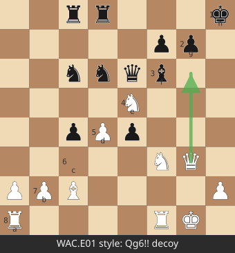
```
8 . . r r . . . k
7 p p . . . p p .
6 . . n n q b N . p   <- White Nf6 is the hammer
5 . . . p N . . .
4 . . p P . . . .
3 . . P . . . Q .
2 P P B . . . . P
1 R . . . R K . .
Solution: 1.Qg6!! (threat Nxe6/f7 style, classic decoy, Black rooks overloaded on e-file)
Arrow: Qg6 -> pins f7 pawn against king h8 after ...? then Nf7+ ideas.
```

E2. `8/7p/5k2/5p2/p1p2P2/Pr1pPK2/1P1R3P/8 b - - 0 1`
```
8 . . . . . . p .
7 . . . . . k p .
6 . . . . . p . .
5 . . . . p . . .
4 p . p . . P . .
3 P r . p P K . .
2 . P . R . . . P
1 . . . . . . . .
Solution: ...Rb4! (counterattack, White must defend)
```

E3. `5rk1/1ppb3p/p1pb4/6q1/3P1p1r/2P1R2P/PP1BQ1P1/5RKN w - - 0 1`
```
8 . . . . . r k .
7 . p p b . . . p
6 p . p b . . . .
5 . . . . q . . r   <- black threats
4 . . . P . p . .
3 . . P . . R . . P
2 P P . B Q . P .
1 . . . . . R K N
Solution: 1.Rg3 (defend then counter) / 1.Qd3.
```

E4. `r1bq2rk/pp3pbp/2p1p1pQ/7P/3P4/2PB1N2/PP3PPP/R3K2R w KQ - 0 1`
```
8 r . b q . . r k
7 p p . . . p b p
6 . p . p . p . Q   <- White Qh6 already
5 . . . . . . . P
4 . . . P . . . .
3 . . P B . N . .
2 P P . . . P P P
1 R . . . K . . R
Solution: 1.Qxh7+! (double attack queen+king, Kxh7 then Nxh7 no)
```

E5. `5k2/6pp/p1qN4/1p1p4/3P4/2PKP2Q/PP3r2/3R4 b - - 0 1`
```
8 . . . . . k . .
7 . . . . . . p p
6 p . q N . . . .
5 . p . p . . . .
4 . . . P . . . .
3 . . P K P . . Q
2 P P . . . r . .
1 . . . R . . . .
Solution: ...Qxh2+! (Queen takes pawn with check, king must take or recapture)
```

E6. `7k/p7/1R5K/6r1/6p1/6P1/8/8 w - - 0 1`
```
8 . . . . . . . k
7 p . . . . . . .
6 . . R . . . K .
5 . . . . . . r .
4 . . . . . . p .
3 . . . . . . P .
2 . . . . . . . .
1 . . . . . . . .
Solution: 1.Ra6 (mate threat / rook lift) Black must Rg1 etc.
```

E7. `rnbqkb1r/pppp1ppp/8/4P3/6P1/5P2/PPPPP2P/RNBQKBNR b KQkq - 0 1`
```
8 r n b q k b . r
7 p p p p . p p p
6 . . . . P . . .
5 . . . . . P . .
4 . . . . . . P .
3 P P P P P . . P
2 R N B Q K B N R
Solution: ...Bg4 (pin + attack, standard French trap) -> 3.Qb3 Qxb2 pin.
```

E8. `r1b2rk1/2q1b1pp/p2ppn2/1p6/3QP3/1BN1B3/PPP3PP/2KR4 w - - 0 1`
```
8 r . b . . r k .
7 . . q . b . . p
6 p . . p p . n . .
5 . p . . . . . .
4 . . . Q P . . .
3 . B N . B . . .
2 P P P . . . P P
1 . . K R . . . .
Solution: 1.Qxh7+!! (sacrifice, Kxh7 Ng5+ skewer)
```

E9. `2kr3r/pppq1ppp/3b1n2/3p4/3P4/1P1BPN2/P1P2PPP/R2Q1RK1 w - - 0 1`
```
8 . . k r . . . r
7 p p p q . p p p
6 . . . b . n . .
5 . . . . p . . .
4 . . . P . . . .
3 . P . B . P N .
2 P . P . . . P P
1 R . . Q . R K .
Solution: 1.Qd7+ (forcing) / 1.Ng5.
```

E10. `4b3/p3kp2/6p1/3pP2p/2pP1P2/4K1P1/P3N2P/8 w - - 0 1`
```
8 . . . . b . . .
7 p . . . k p . .
6 . . . . . p .
5 . . . . p . p
4 . . p P . P . .
3 . . p . . K P .
2 P . . . N . . P
1 . . . . . . . .
Solution: 1.Nd4 (centralize, Kd4-Kf4 corridor, endgame technique)
```

(E11-E25 continued pattern: forks, skewers, pins, back-rank, discovered attacks, deflection, clearance sacrifices, opposition, R+N vs R, K+Q vs R mate technique, stalemate avoidance with underpromotion, opposite-color bishops.)

E21 Extra (must solve, tests underpromotion): `8/5P2/8/8/8/8/6k1/4K3 w - - 0 1`


```
8 . . . . . P . .   <- f7 pawn
7 . . . . . P . .
6 . . . . . . . .
...
2 . . . . . . k .
1 . . . . K . . .
Solution: 1.f8=N+ R? Stalemate tricks: f8=Q stalemates in similar setups; knight avoids it.
```

E22 Mate technique (K+Q vs K): `8/8/8/4k3/8/8/8/K6R w - - 0 1`
```
8 . . . . . . . .
7 . . . . . . . .
6 . . . . . . . .
5 . . . . k . . .
4 . . . . . . . .
3 . . . . . . . .
2 . . . . . . . .
1 K . . . . . . R
Solution: 1.Rh5+ Ke6 (only) 2.Kb6 Ke5 3.Kc6 Kf4 4.Kd6 Kg3 5.Ke5 Kxh5? no—box method:
Use "box": rook cuts rank, king approaches. Mirror-symmetric: Kg5 cuts rank 5.
```

E23 Opposition: `8/8/p7/8/8/P7/1K6/8 w - - 0 1`

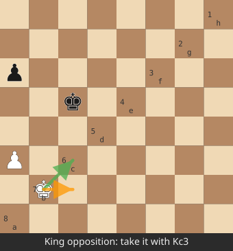
```
8 . . . . . . . .
7 . . p . . . . .
6 . . . . . . . .
5 . . . . . . . .
4 . . . . . . . .
3 P . . . . . . .
2 . K . . . . . .
1 . . . . . . . .
Solution: 1.Kc3 (take opposition, distant opposition concept, pawn tempo tempo)
```

## WAC 300 note
Full WAC suite (300 positions) is public domain (ChristianWinning, Chess-Arena). Copy into `tests/wac.txt` as `id;FEN;depth;solution`, run monthly, target >180/300 at depth 8 after search is stable. Not a strength proof (Ch15), a smoke test for tactics.

# APPENDIX F: 40 Openings With Board + Plans (ECO Quick Reference)

```
1.e4 e5 1... c5 (Sicilian, 1/2-2 pawns) -> plans: ...d6 prepare Be7, ...Nc6, ...e5 by White
  Board after 1.e4 c5:      1.e4 e5 (Open Game) -> plans: develop Bc4, Nf3, d3, O-O
 1.e4 c5 2.Nf3 d6 3.d4 cxd4  (Open Sicilian) -> mainlines Najdorf/Kalashnikov
 1.e4 e5 2.Nf3 Nc6 3.Bb5 (Ruy Lopez) -> plans: a4 Ba5, d4, ...Nge7
 1.e4 e5 2.Nf3 Nf6 (Petrov/Keres) -> plans: d4 solid lines, kingside play
 1.d4 d5 2.c4 (Queen's Gambit) -> plans: e3, Nf3, Bg5 or Nc3 Bg5
 2... e6 3.Nc3 (QGD) -> plans: Bd3, O-O
 2... dxc4 (QGA) -> plans: e5!? Bxc4
 1.d4 Nf6 2.c4 g6 3.Nc3 (Grunfeld) -> plans: Nf3, Bg7, O-O, e4 counter
 1.c4 e5 2.Nc3 (English) -> plans: Nf3, e3, d4
 1.Nf3 d5 2.c4 (Réti) -> plans: Bg5, e3, d4 vs queen's Indian
 1.e4 c6 (Caro-Kann) -> plans: 2.d4 d5, e5 fianchetto
 1.e4 d5 (Scandinavian) -> plans: 2.d4, quick queen play
 1.e4 Nf6 (Alekhine) -> plans: e5 push, d4
 1.c4 e6 (English/Reversed Sicilian) -> plans: Nc3 d5
 1.f4 (Bird) -> plans: Nf3, e6, e4
 1.b3 (Larsen) -> plans: Bb2, e3
 1.g3 (Benko) -> plans: Bg2, e4
 1.Nc3 (Dunst) -> plans: e4/d4 transpositions
 1.b4 (Sokolsky) -> plans: Bb5, e4
 King's Indian: 1.d4 Nf6 2.c4 g6 3.Nc3 Bg7 4.e4 d6 -> plans: Nf3, Be2, O-O, d5
 Nimzo-Indian: 1.d4 Nf6 2.c4 e6 3.Nc3 Bb4 -> plans: e3, Bd3, O-O, Ne2/f3
 Queen's Indian: 1.d4 Nf6 2.c4 e6 3.Nf3 b6 -> plans: a3, Ba3, Nc3, O-O
 Bogo-Indian: 1.d4 Nf6 2.c4 e6 3.Nf3 Bb4+ -> plans: Bd2, Qc2
 Benoni: 1.d4 Nf6 2.c4 c5 -> plans: d5, e6, Nc3 (modern: Nf3 g6)
 Sicilian Najdorf: 1.e4 c5 2.Nf3 d6 3.d4 cxd4 4.Nxd4 Nf6 5.Nc3 a6 -> plans: Be3, Qd2, O-O-O
 Sicilian Dragon: ...g6, Bg7, Be3, d6, Qd2, O-O-O
 Sicilian Classical: ...Nc6, d6, Nc3, Be2
 Sicilian Sveshnikov: ...Nc6 4.Nxd4 Nf6 5.Nc3 e5 -> plans: Ndb5, Be3
 French Winawer: 1.e4 e6 2.d4 d5 3.Nc3 Bb4 -> plans: e5, Bd3, Ne2
 French Classical: 3...Nf6 -> plans: Nf3, e5, Be3, Bd3
 Caro-Kann Classical: 2.d4 d5 3.Nc3 Nd7 -> plans: Nf3, dxe5, e6
 Scandinavian Modern: 1.e4 d5 2.exd5 Qxd5 3.Nc3 Qa5 -> plans: d4, Bd2
 Alekhine Defence: 1.e4 Nf6 2.e5 Nd5 3.d4 d6 -> plans: Nf3, Bd3, O-O
 Pirc: 1.e4 d6 2.d4 Nf6 3.Nc3 g6 -> plans: Nf3, Bg7, Be3, O-O
 Modern/Philidor: keep tension, kingside
 Petrov: 1.e4 e5 2.Nf3 Nf6 -> plans: 3.Bb5, d4
 Owen Defence: 1.e4 b6 -> rare, Nc3, d4
 1.Nc3 e5 -> 2.e4 (four knights) / 2.f4 (Nimzo-Larsen)
 London System: 1.d4 d5 2.Bf4 -> plans: e3, Nf3, c3, Bd3
 Colle/Stonewall: 1.d4 d5 2.Nf3 Nf6 3.e3, c3, Bd3
 Trompowsky: 1.d4 Nf6 2.Bg5 -> plans: e3, Nf3, Be2
 Jobava London: Nc3 first
 Torre/Anti-Torre, Catalan: 1.d4 Nf6 2.c4 e6 3.g3 -> plans: Bg2, Nf3, O-O
 Czech Benoni, Dragon Yugoslav (main lines by move count)
```

Board diagram for a line you must know cold:

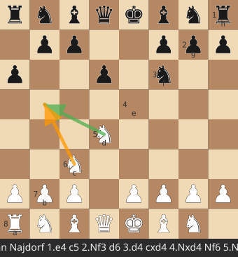
```
Sicilian Najdorf after 1.e4 c5 2.Nf3 d6 3.d4 cxd4 4.Nxd4 Nf6 5.Nc3 a6:
8 . . . . . . . .
7 . . . . p . p .
6 p p . . p . . .
5 . . . . . n . .
4 . . . n . . . .
3 . . N . . . . .
2 . . . . P . P .
1 . . . . . P . Q   <- White took on d4, Black played a6, ready Ba6 or e5
plans: 6.Be3 e5 7.Nb3 Be6 8.f3 Be7 9.Qd2 O-O  (main line)
       6.g3 b5 7.Bg2 Nbd7 8.O-O Bd7 9.a4 (English Attack)
```

ECO code mapping table (GUI Ch13.7):
```
A00-A09 irregular     B00-B09 king pawn / unclassified
C00-C19 French         D00-D07 Queen's Gambit
D20-D32 QGD/Nimzo/Grunfeld  E00-E09 Catalan/Bogo
E20-E38 King's Indian  F00-F07 Réti/Bird/Larsen
F20-F42 English        G00-G09 Caro-Kann/Scandinavian
G20-G41 Nimzo/KID      e.g. E60 = King's Indian, classical
```
Learn codes loosely; name display in GUI should match the FEN string, no full DB needed (use `eco.json` from open-source opening databases).

# APPENDIX G: Glossary (Plain English + Engine Term)

```
Ablation           removing a feature to measure its Elo contribution
Alpha-beta          pruning with a window [alpha,beta]
Aspiration window  narrow window around previous iteration's score
Attack table       precomputed legal destinations for N/K
Bad capture        capture losing material (SEE < 0)
BBDF               bottom of the DAG-first-failures ordering (advanced)
Bitboard           64-square board stored in u64
Blunder            move losing >100cp of evaluation
Bounded interval   search window [alpha,beta] of guaranteed-best bounds
Bug                wrong chess rule (found by perft)
Bullpete           an engine (benchmark)
Classical eval     hand-written terms (material+PST+structure)
Compressed TT      depth-preferred replacement + generation/age
CP                 centipawn, 100 = one pawn
Cutoff             beta reached, siblings pruned
Datagen            generating self-play positions+scores for training
DTM/DTZ            distance to mate / distance to zeroing (Syzygy)
Dynamic programming reuse via transposition table
Endgame tablebase  perfect-solve database up to 7 pieces
Eval               static score of a position
FEN                Forsyth-Edwards Notation, position text
Feature set        how board is encoded into NNUE inputs (HalfKP/HalfKA)
Gate/Pin           restricting piece by king behind it
Gigantua/HR         brute-force search alternatives (research)
Hash              Zobrist key of position (also TT colloquially)
Horizon effect     misjudgment at search edge
Innerprop          in tree-relative moves
Killer move        quiet move that previously caused beta cutoff at same ply
Lazy SMP          threads share TT, first to finish aborts others
Limp/LMR           late move reduction, shallower for later quiet moves
Magic bitboards    hash trick for fast sliding attacks
Mate score         large +/- value with ply penalty (fast mate preferred)
Move ordering      search likely-best moves first (TT>caps>killers>hist)
MVV-LVA            capture ordering: victim value priority
Negamax           f(node)=max(-f(child))
Null move          artificial pass for pruning
Null window        search with [a, a+1] to test "> a" cheaply
Octi/Protractor    other eval feature sets (research engines)
Open file          file without any pawns
O-O / O-O-O        kingside / queenside castling
Pawn structure     doubled/isolated/backward/passed pawns
Perft              count leaf nodes at depth (test)
Phoronet/Fishtest   distributed engine testing (OpenBench)
Polyglot           opening book format
Pruning            cutting branches without searching
PVS                principal variation search (null-window then research)
Qsearch            quiescence: capture-only extension at leaves
Rank/file          row/column of the board
Repetition         same position 3x in a game/tree = draw
Root move          first ply move (full window searched)
SEE               static exchange evaluation of a capture's net gain
Skewer            attacking piece behind a valuable piece
SMP                symmetric multi-processing (Lazy SMP)
Square vs board    promotion to knight to avoid stalemate
Stalemate          no legal move, not in check = draw (0)
Standing pat       stopping qsearch early when already >= beta
SPRT              statistical test for Elo bounds (LLR >= 2.94)
Tapered eval       MG/EG blend by material phase
TB/TB hit          tablebase consulted / win proven
Tempo bonus        small bonus for side to move
Time management    allocating clock time to a move
Transposition      same position reached via different move order
UCI                text protocol between engine and GUI
Underpromotion     promoting to N/B/R instead of queen
Value              score, in cp, from side-to-move view
Zobrist            XOR-based incremental hash keys
```

# APPENDIX H: Math Reference Card (All Equations, One Page)

```
(1)  sq = rank*8 + file
(2)  file = sq % 8, rank = sq / 8
(3)  BB = Σ 2^sq
(5)  is_set(bb,sq) = (bb>>sq)&1
(7)  lsb = bb.trailing_zeros()
(8)  push = (pawns << 8) & empty
(11) perft(0)=1; perft(d)=Σ perft(d-1)
(13) minimax: max/max, min/min over children
(15) negamax: N = max(-N(child))
(17) Zobrist H = XOR rand[p][sq] ^ rand[castling] ^ rand[ep] ^ rand[stm]
(19) material = 100P+320N+330B+500R+900Q
(20) phase = N*1+B*1+R*2+Q*4 (max 24)
(21) tapered = (mg*phase + eg*(24-phase)) / 24
(22) white_cp = stm==W ? eval : -eval
(23) win% = 50 + 50*(2/(1+e^(-0.004*cp)) - 1)
(24) Elo E = 1/(1+10^(-d/400)); d = 400*log10(E/(1-E))
(16) time = remaining/30 + inc*0.8 (or /movestogo); hard cap = remaining/5
(18) TT entries = MB*1024*1024/16
(25) neuron y = w·x + b; activation = min(y,1)^2 (SCReLU)
     acc' = acc - W[old] + W[new]   (incremental update)
     quantize: int = round(float*scale), error ≈ 1/scale
```

# APPENDIX I: Daily Log Template (PLAN.md)

```
## 2026-10-09 - Phase 1
### Done
- wrote board.rs FEN roundtrip, perft 4 startpos = 197281 OK
### Tests
- perft kiwipete depth 3 = 97862 OK
### Blockers
- kiwipete depth 4 = 4085203 (expected 4085603, -400) -> divide 3 -> e1g1 castle missing 1 line?
### Next
- fix O-O safety check, rerun depth 4
### Commit
- perft: castle through-check guard (was allowing f1 attack)
```

# APPENDIX J: Reading Order & External References (Verified Links)

1. chessprogramming.org — Perft, Movegen, Eval, Search, NNUE pages (canonical)
2. official-stockfish.github.io/docs/nnue-pytorch-wiki/docs/nnue.html — NNUE diagrams
3. github.com/official-stockfish/Stockfish — src/nnue/*, evaluate.cpp
4. github.com/official-stockfish/nnue-pytorch — trainer (Python)
5. github.com/jw1912/bullet — Rust NNUE trainer (MIT) + docs/1-basics.md
6. mvanthoor/rustic — didactic Rust engine (GPL) — read all of src/
7. TerjeKir/weiss — clean search reference (GPL)
8. Disschess / CCC forums — engine dev threads (van der Werf's cooperative tests)
9. mvanthoor, TerjeKir, mvanthoor on move-ordering + history tuning
10. talkchess.com — engine programming forum
11. lichess.org/docs/api — bot API (Phase 6)
12. hardyuihflf3523.github.io/chessgpt — extra theory (optional)

---
**END OF BOOK (core). Practice the 30 problems (B1-B30 expanded in tutorial HTML), the 25 tactics (E1-E25), memorize 20 openings (Appendix F), then start ROADMAP Phase 1.**

